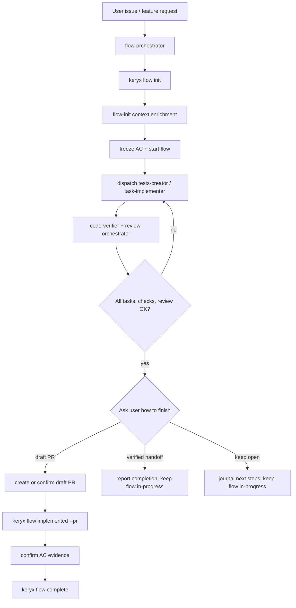

# Flow Orchestrator

## Purpose

Flow Orchestrator is the Task Manager-aware implementation orchestrator.
It wraps the existing gdskills pipeline with `keryx flow` state.

Use this skill instead of `job-orchestrator` when the user wants a managed
story/issue lifecycle with frozen acceptance criteria, task state, an explicit
completion choice, Code Health, and a durable flow package in
`.metaproject/flows/`.

Do not modify `job-orchestrator` or `task-implementer` behavior. They remain
usable without Task Manager. This skill coordinates them through flow state.

## Hard Preconditions

1. Read `.metaproject/index.md` and `.metaproject/metaproject.json`.
2. Confirm Task Manager is enabled:
   - `.metaproject/metaproject.json` must contain `modules.tasks.enabled: true`;
   - `.metaproject/skills/flow/SKILL.md` should exist.
3. If Task Manager is not enabled, stop and tell the user to run:

```bash
keryx update
```

or initialize with the Task Manager module enabled. Do not emulate flow state by
hand.

## Source Of Truth

Flow state lives in `.metaproject/flows/<flow-id>/`.

CLI-owned files:

- `flow.json` - never edit by hand.
- status transitions - only through `keryx flow ...`.
- task status - only through `keryx flow task done ...`.
- frozen acceptance criteria changes - only through
  `keryx flow ac update <id> --reason "<why>"`.

Agent-editable files:

- `description.md`
- `context.md`
- `plan.md`
- `tasks.md` for task definitions only
- `journal.md`

## Lifecycle



## Phase 0: Route And Resume

1. Run `keryx flow list`.
2. If an active flow obviously matches the user request, use it.
3. If multiple active flows could match, ask one concise question.
4. If no flow exists and the request is multi-step, create one:

```bash
keryx flow init --issue <url>
```

or:

```bash
keryx flow init --title "<short formalized problem>"
```

5. Run `keryx flow status <id>` and read the flow package.

## Phase 1: Initialize The Flow Package

Use `.metaproject/skills/flow/init.md` as the local flow-init procedure.

Required context sources:

- gdgraph for impacted files and dependency relationships;
- gdctx for compact command/search/diff output;
- gdwiki for architecture, domain rules, business behavior and decisions;
- memory for lessons learned, repeated failures and historical constraints;
- health/testing reports for baseline risk.

Required rules:

- `.metaproject/rules/core/requirements-management.mdc`
- `.metaproject/rules/core/implementation-plans.mdc`
- `.metaproject/rules/core/subagent-context-construction.md`
- `.metaproject/rules/core/subagent-status-protocol.md`
- `.metaproject/rules/core/tdd-workflow.mdc`
- `.metaproject/rules/core/code-style-patterns.mdc`
- `.metaproject/rules/core/error-handling.mdc`
- `.metaproject/rules/core/implementation-doc-mandate.mdc`
- `.metaproject/rules/core/execution-metrics.md`

Execution metrics (opt-in): when a USER runs this orchestrator directly, at the
start ask "Collect execution statistics for this run? (yes/no)" per
`rules/core/execution-metrics.md`. If yes, append the `## Execution Metrics`
section at the end and save it under the flow dir (`<flow-dir>/metrics/`). Never
ask or emit it when dispatched as a subagent.

Write or update:

- `description.md` - problem, expected outcome, out of scope;
- `context.md` - compact links and findings, not raw dumps;
- `plan.md` - chosen approach and trade-offs;
- `tasks.md` - task definitions grouped by context, test, implement, review, docs;
- `acceptance-criteria.md` - verifiable `ACn` criteria.

Then freeze and start:

```bash
keryx flow freeze <id>
keryx flow start <id>
```

## Phase 2: Execute Tasks

Use existing gdskills as workers. Do not duplicate their internal workflows.

Recommended worker routing:

| Flow task kind | Worker skill |
|---|---|
| `context` | `context-collector` |
| `test` | `tests-creator` or `test-gen` |
| `implement` | `task-implementer` |
| `review` | `review-orchestrator` |
| `docs` | `job-documenter`, `prd-creator`, or documentation-specific project skill |

### Worker communication is schema-governed

Workers do not inherit session state; every dispatch is constructed explicitly
(`.metaproject/rules/core/subagent-context-construction.md`). Each dispatch is a
`subagent-dispatch` object
(`.metaproject/core/gdskills/contracts/subagent-dispatch.schema.json`) and each
worker reply is a `subagent-result` object
(`.metaproject/core/gdskills/contracts/subagent-result.schema.json`) whose first
line is `STATUS: <status>`
(`.metaproject/rules/core/subagent-status-protocol.md`).

Dispatch payload, bound to the flow (map `target_skill` from the routing table):

```json
{
  "contract_version": "1.0.0",
  "run_id": "<flow-id>",
  "dispatch_id": "<flow-id>-<Tn>",
  "orchestrator": "flow-orchestrator",
  "target_skill": "task-implementer",
  "task": { "title": "<Tn title>", "description": "<what to do>", "intent": "implement" },
  "acceptance_criteria": ["<the frozen ACn lines this task must satisfy>"],
  "context_refs": [
    { "path": ".metaproject/flows/<dir>/context.md", "kind": "context", "exists": true },
    { "path": ".metaproject/flows/<dir>/plan.md", "kind": "plan", "exists": true },
    { "path": ".metaproject/flows/<dir>/acceptance-criteria.md", "kind": "custom", "exists": true }
  ],
  "files_to_read": ["<only files gdgraph/gdctx narrowed to>"],
  "constraints": [
    "Never edit flow.json.",
    "Never edit frozen acceptance criteria.",
    "Return a subagent-result; first line must be STATUS:."
  ],
  "allowed_actions": ["read", "write", "run-command", "git"],
  "output_contract": { "schema": "subagent-result", "artifact_path": ".metaproject/flows/<dir>/journal.md" },
  "budget": { "max_output_tokens": null },
  "provenance": { "created_at": "<iso-utc>", "created_by": "flow-orchestrator" }
}
```

After a worker succeeds, the flow-orchestrator marks task progress:

```bash
keryx flow task done <id> <Tn>
```

If new work is discovered:

```bash
keryx flow task add <id> --title "<task>" --kind <kind>
```

### Interpreting worker results (STATUS protocol)

Read the worker's `STATUS:` line first; never infer the outcome from prose. A
reply with no `STATUS:` line is treated as `NEEDS_CONTEXT` — re-request one
properly formatted `subagent-result`.

| Worker `status` | flow-orchestrator action |
|---|---|
| `DONE` | Accept. `keryx flow task done <id> <Tn>`. Continue. |
| `DONE_WITH_CONCERNS` | Accept, record every concern in `journal.md`, decide continue vs. add a fix task, then `flow task done`. Never silently drop concerns. |
| `NEEDS_CONTEXT` | Do not fail. Enrich `context_refs`/`files_to_read` from gdgraph/gdctx/wiki/memory, then re-dispatch the same `dispatch_id`. |
| `BLOCKED` | `keryx flow block <id> --reason "<worker reason>"`; resolve or escalate one concise question, then `flow unblock` and re-dispatch. |
| `FAILED` | Retry once with the same dispatch. If it fails again, block the flow and surface the error to the user. |

Carry `run_id`/`dispatch_id` across retries so the flow journal stays traceable.

## Phase 3: Verification And Review

Before accepting implementation:

1. Run focused tests for touched scope.
2. Run `code-verifier`.
3. Run `keryx health run` when Code Health is enabled.
4. Run `review-orchestrator` with relevant domains.
5. If findings require code changes, dispatch fix work through `task-implementer`
   and record the fix task in the flow.
6. Close the skill-learning loop (see `rules/core/skill-lifecycle.mdc`). Collect
   the `skill_drift` fields from task-implementer results and the
   `## Skill Learning` block from review-orchestrator. For each flagged
   project-skill, dispatch a subagent — on a cheaper / non-flagship model if one
   is available (`.metaproject/scripts/detect-models.sh`; see
   `rules/core/model-selection.mdc`), otherwise the session model — to run
   `keryx skills learn --from-review <report> --skill <m>/<s>` and return the
   proposal. Then read the proposal and `skills learn apply` it, or discard it.
   Never apply unread; never put `learn` in a hook.

The implementer never self-accepts. Only flow-orchestrator decides whether the
flow can move to `implemented`. Record any applied skill updates in the
completion report.

## Phase 4: Completion Choice

When tasks, verification and review are complete:

1. Stop before creating a PR or changing the flow to `implemented`.
2. Ask the user how to finish. Do not infer that every flow needs a PR:

```text
How should this flow end?

  A) Create a draft PR and complete the managed flow
  B) Finish with a verified handoff and no PR
  C) Keep the flow open for more work

> pick a letter (no default; wait for the user)
```

3. Follow the selected outcome:

- **A - Draft PR:** create or confirm a draft PR in the author's name, then
  record it through the CLI:

```bash
keryx flow implemented <id> --pr <draft-pr-url>
```

- **B - Verified handoff without PR:** do not create a PR and do not run
  `keryx flow implemented` or `keryx flow complete`. Produce the completion
  report with verification and acceptance-criteria evidence, record that the
  implementation work is finished, and leave the Task Manager flow
  `in-progress`. Explain that the current CLI requires a recorded PR before it
  can transition the flow to `done`.
- **C - Keep open:** record remaining or deferred work in `journal.md`, report
  the current verification state, and leave the flow `in-progress` for resume.

Only continue to Phase 5 after the user selects A and the draft PR is recorded.

## Phase 5: Complete The Flow

Use `.metaproject/skills/flow/complete.md`.

For every acceptance criterion, verify evidence and confirm:

```bash
keryx flow ac confirm <id> ACn --note "<evidence>"
```

Then run:

```bash
keryx flow complete <id>
```

If gates fail, the CLI returns the flow to `in-progress`. Add a journal note,
create fix tasks, and repeat Phase 2.

## Completion Report

Finish with:

- flow id and final status;
- selected completion outcome;
- PR URL when a PR was created;
- tasks completed;
- acceptance criteria evidence summary;
- verification/review results;
- unresolved risks or blocked gates.

For a verified handoff without PR, distinguish "implementation work finished"
from Task Manager status `done`: report the flow as `in-progress` and explain
why it was intentionally not transitioned.

## Contracts

flow-orchestrator communicates through explicit schemas, not free prose:

| Direction | Schema |
|---|---|
| Skill input | `skills/gdskills/orchestration/flow-orchestrator/input-contract.schema.json` |
| Skill output | `skills/gdskills/orchestration/flow-orchestrator/output-contract.schema.json` |
| Worker dispatch | `core/gdskills/contracts/subagent-dispatch.schema.json` |
| Worker result | `core/gdskills/contracts/subagent-result.schema.json` |
| Durable flow state | `.metaproject/flows/<id>/flow.json` (CLI-owned; never agent-written) |

Validate a concrete worker message before trusting it:

```bash
keryx skills contracts validate <file> --schema subagent-dispatch
keryx skills contracts validate <file> --schema subagent-result
```

## Boundaries

- Do not replace `job-orchestrator`. This is the Task Manager variant.
- Do not bypass the flow CLI for state changes.
- Do not let `task-implementer` edit `flow.json`, frozen AC, or decide
  completion.
- Do not read broad source trees when gdgraph/gdctx/wiki/memory can first
  narrow context.
