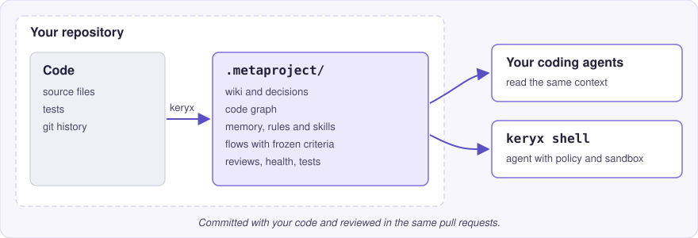

<!-- synced-with: README.md @ PENDING -->

<p align="center">
  <picture>
    
  </picture>
</p>

<p align="center"><strong>Единый локальный «мозг» проекта для ваших ИИ-агентов и вашей команды.</strong></p>

<p align="center">
  <a href="https://github.com/MrCipherSmith/keryx/actions/workflows/ci.yml"></a>
  <a href="https://www.npmjs.com/package/@mrciphersmith/keryx"></a>
  <a href="LICENSE"></a>
  <a href="https://mrciphersmith.github.io/keryx/"></a>
  <a href="https://mrciphersmith.github.io/keryx/getting-started/install/#bun-version"></a>
</p>

<p align="center">
  <a href="README.md">English</a> | Русский
</p>

<p align="center">
  <a href="https://mrciphersmith.github.io/keryx/">Документация</a> ·
  <a href="https://mrciphersmith.github.io/keryx/getting-started/quickstart/">Быстрый старт</a> ·
  <a href="https://mrciphersmith.github.io/keryx/modules/project-knowledge/">Модули</a> ·
  <a href="CHANGELOG.md">Изменения</a>
</p>

```bash
npm install -g @mrciphersmith/keryx
```

<p align="center">
  
</p>

> Это перевод [README.md](README.md). Английская версия основная; перевод может
> немного отставать. Документация на сайте доступна на английском.

## Что такое Keryx

Keryx хранит знания, правила и историю работы над проектом в каталоге
`.metaproject/` рядом с кодом. Ваши агенты читают его, оболочка `keryx`
работает на его основе, а команда проверяет его в тех же пул-реквестах, что и
код. Граф, вики, память и проверки работают локально без модели; провайдер
нужен только агентной оболочке и нескольким командам, которые пишут текст.

- **Контекст проекта в репозитории.** Граф кода, вики, решения и уроки:
  агент спрашивает проект, а не перечитывает его заново.
- **Собственная агентная оболочка.** `keryx shell` работает на выбранном вами
  провайдере моделей, под политикой «разрешить, спросить или запретить» и в
  песочнице операционной системы.
- **Управляемая работа.** Flow фиксирует критерии приёмки до начала работы и
  завершается, только когда каждый из них подтверждён записанными
  доказательствами.
- **Ревью с записью.** Раунды ревью и их замечания хранятся в файлах и
  переживают ветку.
- **Работает с вашими агентами.** Keryx встраивает свой контекст в агентов и
  редакторы, которыми вы уже пользуетесь; переходить на другой инструмент не
  нужно.

## Установка

Установите командой из верха страницы и проверьте через `keryx --version`.
Пакет работает на [Bun](https://bun.sh) 1.3.14 или новее, поэтому Bun должен
быть в `PATH`. Автономный бинарный файл, которому не нужен Bun, и два
установщика на основе клонирования описаны в разделе
[Install](https://mrciphersmith.github.io/keryx/getting-started/install/).

Имя пакета содержит scope. Пакет `keryx` без scope в npm — посторонний проект;
устанавливайте `@mrciphersmith/keryx`, он предоставляет команду `keryx`.

## Быстрый старт

Создайте проект из трёх файлов (`checkout.ts` импортирует `cart.ts`, а тот —
`price.ts`) и добавьте в него Keryx:

```bash
mkdir -p demo/src && cd demo
printf 'export function applyDiscount(total: number, percent: number): number {\n  return Math.round(total * (100 - percent)) / 100;\n}\n' > src/price.ts
printf 'import { applyDiscount } from "./price";\n\nexport function cartTotal(prices: number[], discount = 0): number {\n  return applyDiscount(prices.reduce((a, b) => a + b, 0), discount);\n}\n' > src/cart.ts
printf 'import { cartTotal } from "./cart";\n\nexport const checkout = (prices: number[]) => cartTotal(prices, 10);\n' > src/checkout.ts
git init -q && git add -A && git commit -qm "Initial commit"

keryx init --yes
git add -A && git commit -qm "Add keryx workspace"
keryx doctor
keryx gdgraph build
keryx gdgraph affected src/price.ts
```

Последняя команда по графу кода отвечает, что зависит от `price.ts`, не читая
все файлы:

```text
# Affected context for src/price.ts

## Dependencies
- none

## Dependents
- src/cart.ts
```

`keryx init` записывает свои правила игнорирования в `.git/info/exclude` и не
трогает отслеживаемые файлы инструкций для агентов. Когда будете готовы
работать с агентом, запустите `keryx shell`; при первом запуске он спросит,
какой провайдер моделей использовать. Полный
[Quickstart](https://mrciphersmith.github.io/keryx/getting-started/quickstart/)
продолжает с вики, записью решения и оболочкой.

## Что вы получаете

| Что нужно | Что даёт Keryx | Подробнее |
|---|---|---|
| Ответы о коде до того, как агент его правит | Граф кода, компактный вывод команд, вики и память проекта | [Project knowledge](https://mrciphersmith.github.io/keryx/modules/project-knowledge/) |
| Агент, который уже знает репозиторий | `keryx shell` с долговечными сессиями, режимами подтверждения и `/rewind` | [The keryx shell](https://mrciphersmith.github.io/keryx/modules/shell/) |
| Свободный выбор модели | Облачные, по подписке, локальные и любые OpenAI-совместимые провайдеры | [Models and providers](https://mrciphersmith.github.io/keryx/modules/providers/) |
| Ограничения, которые агент не может обойти уговорами | Движок политик, песочница ОС, хуки жизненного цикла и сканер безопасности | [Harness and safety](https://mrciphersmith.github.io/keryx/modules/harness-and-safety/) |
| Тот же контекст в агентах, которыми вы уже пользуетесь | Хуки, файлы инструкций и MCP-сервер для вашего редактора | [Connect your agents](https://mrciphersmith.github.io/keryx/modules/integrations/) |
| Чёткий критерий готовности для делегированной работы | Flows с зафиксированными критериями, журналами, подписанными подтверждениями и пакетами ревью | [Managed work](https://mrciphersmith.github.io/keryx/modules/managed-work/) |
| Проверка состояния кода и нужные тесты | Единый отчёт о состоянии с результатом pass, warn или fail и подбор связанных тестов | [Quality](https://mrciphersmith.github.io/keryx/modules/quality/) |
| Повторяемые процедуры вместо импровизации | Версионируемые навыки, синхронизированные правила агентов и проверенное обучение | [Skills, rules and learning](https://mrciphersmith.github.io/keryx/modules/skills-and-learning/) |
| Запись того, что агент рекомендовал и что выбрали вы | Журнал рекомендаций со слепыми вопросами и отчётом о совпадениях | [Recommendation journal](https://mrciphersmith.github.io/keryx/guides/recommendation-journal/) |
| Обслуживание проекта без вашего участия | Триггеры, задачи агента по расписанию и HTTP-вход, по умолчанию привязанный к loopback | [Automation](https://mrciphersmith.github.io/keryx/modules/automation/) |

## Как это работает

<p align="center">
  
</p>

`keryx` строит и поддерживает `.metaproject/` на основе вашего кода и работы,
которая в нём ведётся. Всё там — Markdown или JSON, поэтому изменения
проверяются в диффе, как любой другой файл. Агенты находят каталог через
короткий файл маршрутизации `.metaproject/index.md`.
[ARCHITECTURE.md](ARCHITECTURE.md) описывает устройство исходного кода, а
[The Metaproject](https://mrciphersmith.github.io/keryx/concepts/metaproject/)
— сам рабочий каталог.

## Что дальше

| Если вы хотите… | Перейдите к |
|---|---|
| За пять минут понять, из чего состоит Keryx | [Keryx in five minutes](https://mrciphersmith.github.io/keryx/getting-started/concepts/) |
| Настроить реальный проект от начала до конца | [Set up a project](https://mrciphersmith.github.io/keryx/guides/set-up-a-project/) |
| Подключить облачную или локальную модель | [Connect a model provider](https://mrciphersmith.github.io/keryx/guides/connect-a-provider/) |
| Подключить Keryx к агенту, которым вы пользуетесь | [Connect your agents](https://mrciphersmith.github.io/keryx/modules/integrations/) |
| Решить, что агенту можно делать без спроса | [Choose an approval mode](https://mrciphersmith.github.io/keryx/guides/permission-modes/) |
| Проводить ревью и сохранять его запись | [Review with a durable record](https://mrciphersmith.github.io/keryx/guides/review-with-a-record/) |
| Запускать Keryx в CI | [Run keryx in CI](https://mrciphersmith.github.io/keryx/guides/run-in-ci/) |
| Управлять запущенной сессией из чата на телефоне (по желанию; подключение через `/channels`) | [Drive keryx remotely](https://mrciphersmith.github.io/keryx/guides/drive-keryx-remotely/#remote-control-from-telegram) |
| Найти команду | [CLI reference](https://mrciphersmith.github.io/keryx/cli-reference/) |

## Статус

Keryx ещё не достиг версии 1.0 и выпускается в серии 0.3.x; текущую версию
показывает значок npm. До 1.0 минорная версия может изменить команду, флаг или
формат файла, и каждое такое изменение записывается в
[журнал изменений](CHANGELOG.md). Поддерживаются macOS и Linux; песочница в
Linux умеет меньше. Работа в Windows не проверена; используйте WSL. На странице
[Project status](https://mrciphersmith.github.io/keryx/project/status/)
указано, что стабильно, а что экспериментально, а на странице
[Limitations](https://mrciphersmith.github.io/keryx/limitations/) — известные
ограничения.

## Сделано с помощью Keryx

Keryx разрабатывается с помощью Keryx. Этот репозиторий хранит в git свой
`.metaproject/`, поэтому план, зафиксированные критерии, журнал и раунды ревью
каждого изменения лежат рядом с кодом, который из них получился, и их можно
прочитать прямо на GitHub. Страница
[Built with Keryx](https://mrciphersmith.github.io/keryx/project/built-with-keryx/)
объясняет эту запись и разбирает одно изменение от начала до конца.

## Сообщество и участие

- Вопросы и помощь: [SUPPORT.md](SUPPORT.md)
- Участие в разработке: [CONTRIBUTING.md](CONTRIBUTING.md) и [план развития](ROADMAP.md)
- Сообщения об уязвимостях: [SECURITY.md](SECURITY.md)
- Правила поведения: [CODE_OF_CONDUCT.md](CODE_OF_CONDUCT.md)

Keryx распространяется по [лицензии MIT](LICENSE).
