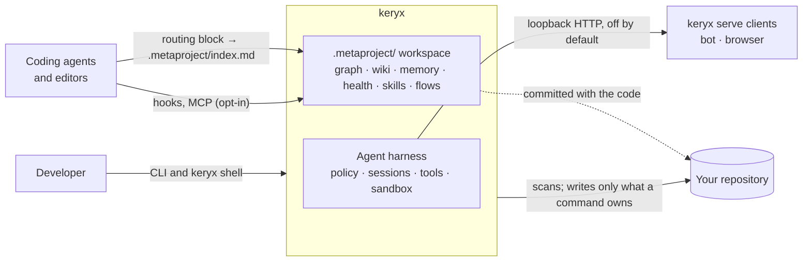
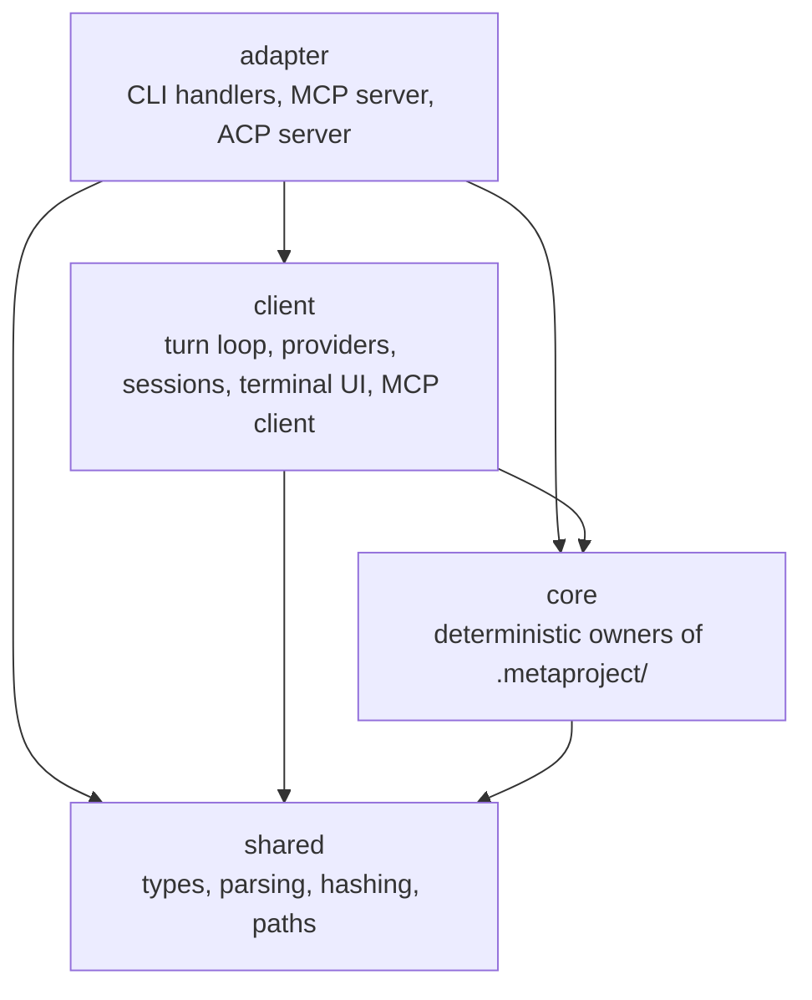
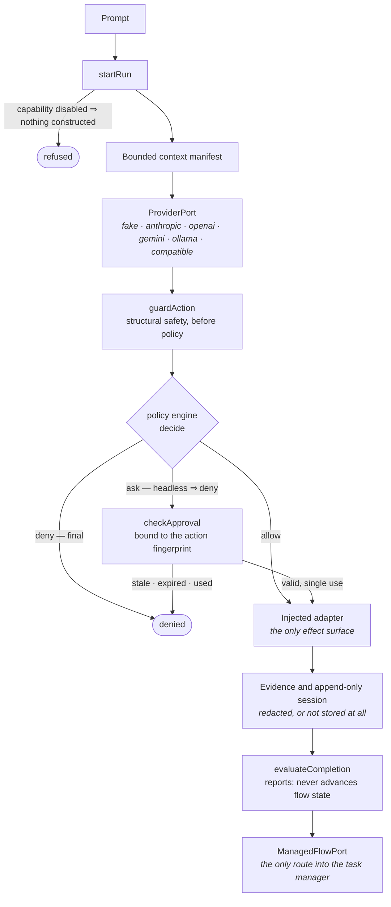
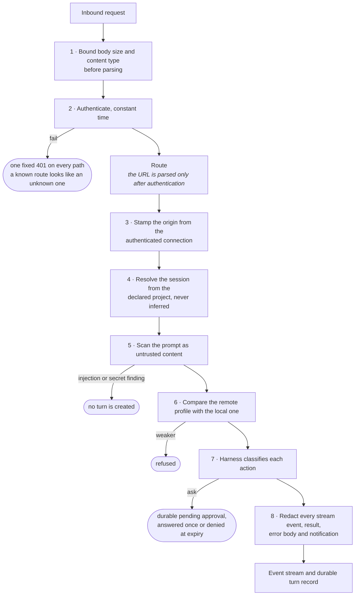
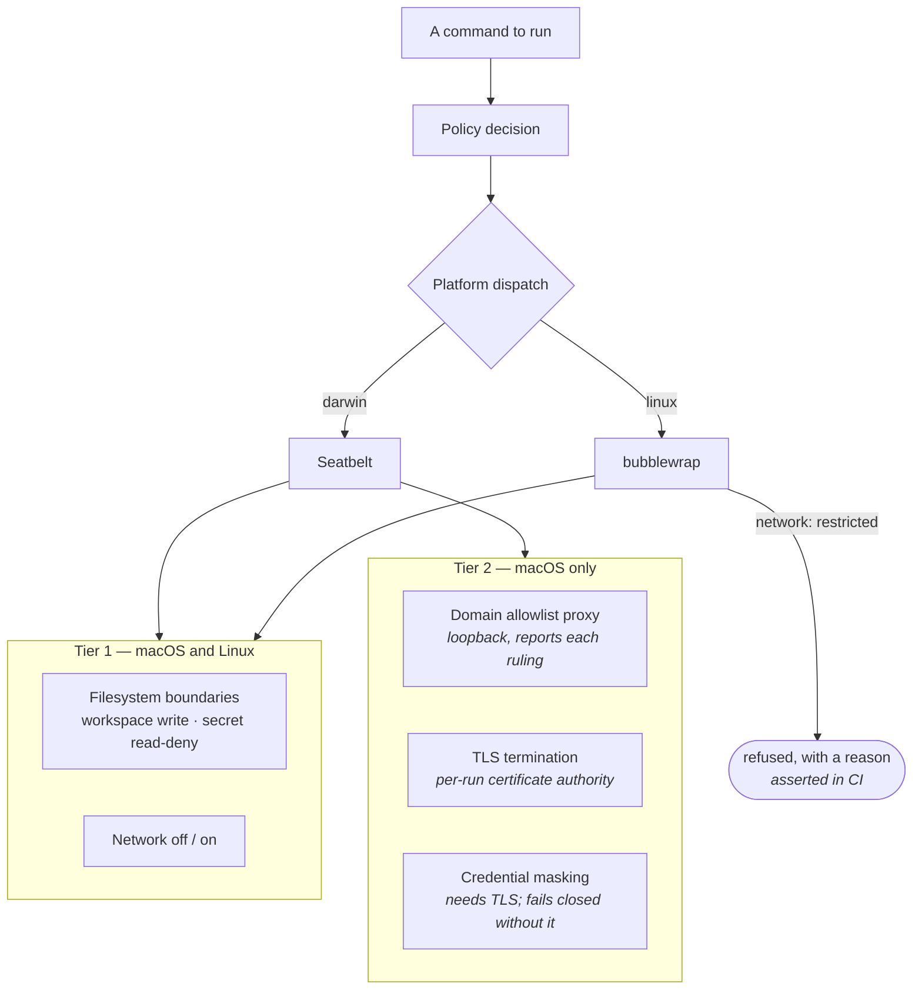
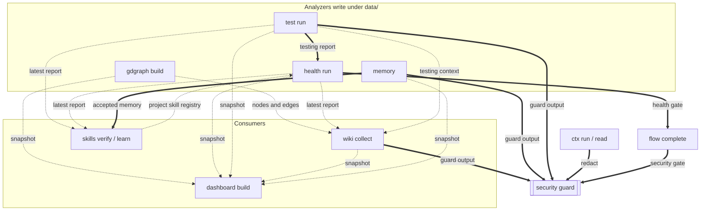

# Architecture

This page explains how Keryx is built: its parts, how they connect, and the
rules the code enforces. It describes version 0.3.46. If you want to change the
code, start with the
[codemap in ARCHITECTURE.md](https://github.com/MrCipherSmith/keryx/blob/main/ARCHITECTURE.md),
which names every directory; this page goes deeper on the flows and the
reasons. Where this page and the code disagree, the code is right and this page
has a bug.

## System overview

Keryx is a single Bun and TypeScript command-line program. It has **no database
and nothing running by default**. Its job is to create and maintain a
`.metaproject/` workspace in a repository: durable Markdown and JSON that make a
coding agent more effective and more accountable in an existing codebase. See
[The Metaproject](concepts/metaproject.md) for what the workspace holds.

The CLI performs only **deterministic work**: scanning, graphing, scoring, state
transitions, checksums, template rendering. Writing prose and making judgements
is left to agents, guided by the skills the workspace ships. State lives on disk
under `.metaproject/` and in one per-user config directory, and external tools
(git, gh, linters, type checkers) are optional.

Two HTTP surfaces exist, and both are **off until you start them**:
`keryx serve-mcp --http` (localhost only, behind a capability switch) and
`keryx serve` (loopback-bound remote entry into the agent harness).



## Code zones

All code lives in one package under `src/`. Each top-level directory belongs to
one of four zones, declared in `src/lib/import-zones.ts` and enforced by
import-policy tests:



- **Core** owns the workspace: graph, wiki, memory, compact output, testing,
  health, flows, review, skills, security and the bookkeeping modules. Core
  never imports client or adapter code; that direction has no exception.
- **Client** is the model runtime: `src/harness/` (turn loop, providers, policy,
  sandbox, subagents), `src/tui/`, sessions and rewind, the agent bus and the
  MCP client.
- **Adapter** exposes core and client to a caller: the CLI handlers, the MCP
  publisher and the ACP server.
- **Shared** holds primitives everyone may import.

`src/core.ts` is the package's library entry point. It exports only core
owners, and a test builds it with the release flags and fails if a provider,
a credential read or a model call becomes reachable from it.

## CLI routing

```text
keryx <verb> ...  →  src/cli.ts main()  →  CLI_ROUTES[verb]  →  src/commands/<verb>.ts
                                                                  │
                                                                  └→ core owners (src/gdgraph, src/wiki, …)
```

- `src/cli.ts` runs a start-up safety guard (see
  [environment isolation](concepts/security-model.md#environment-isolation)),
  resolves the verb and maps errors to exit codes.
- `CLI_ROUTES` in `src/cli-registry.ts` maps every top-level verb to its
  handler: 59 entries, which are about 55 verbs plus aliases such as `dash` and
  `session` and one internal helper.
- `src/commands/<verb>.ts` handlers parse arguments, call the owner for that
  area, print a compact result and set the exit code. They hold little logic.
- `src/lib/group-subcommands.ts` is the real subcommand vocabulary of each
  command group. Group help is generated from it, and a test fails when a
  subcommand is missing from the [CLI reference](cli-reference.md), so the CLI
  and the docs come from one list.

`keryx commands --json` prints the agent-callable command registry, and
`keryx help` groups the whole surface by task.

## Module map

| Module | Directory | CLI verb | Role |
|---|---|---|---|
| **lifecycle** | `src/commands/{init,update,status,modules,doctor,setup,version}.ts` | `init`, `update`, `status`, `modules`, `doctor`, `setup`, `version` | Create, refresh, inspect and diagnose the workspace; toggle modules; check for a newer release. |
| **gdgraph** | `src/gdgraph/` | `gdgraph` | File dependency graph, optional tree-sitter symbol and call graph, affected sets, paths, cycles, repository map; `gdgraph assets` manages grammars. |
| **gdctx** | `src/ctx/` | `ctx` | Compact command, search and read output with a raw log; the per-agent routing guard. |
| **gdwiki** | `src/wiki/` | `wiki` | Wiki pages, drafts from code, links, freshness pins, section search and cited answers. |
| **memory** | `src/memory/` | `memory` | Typed decisions, lessons and constraints with lifecycle, validity dates, lexical search and handoff; `memory assets` manages optional assets. |
| **gdskills** | `src/gdskills/` | `skills` | Bundled and project skills: install, route, verify, learn, export to agents; JSON contracts. |
| **health** | `src/health/` | `health` | Quality signals into per-scope scores, baseline, pass/warn/fail gate, churn and complexity hotspots. |
| **testing** | `src/testing/` | `test` | Test stack detection, the project's own runner, related tests, coverage map. |
| **flow** | `src/flow/` | `flow` | Flow packages, the status state machine and the completion gates (manifest id `tasks`). |
| **job** | `src/job/` | `job` | Job packages for multi-step orchestration. |
| **review** | `src/review/` | `review` | Managed review packages, finding dispositions, the review gate, the pull-request bot. |
| **security** | `src/security/` | `security` | Secret, PII and injection detection, redaction, policy, incidents, hooks, evaluation corpora, the structural command guard. |
| **rules** | `src/rules/` | `rules` | Import agent instruction files into rules and manage the routing block. |
| **agents** | `src/agents/`, `src/harness/external/` | `agents` | Global bootstrap blocks, the named subagent catalog, the fleet monitor, external agent CLIs. |
| **orient** | `src/ctx/orient.ts` | `orient` | A bounded start-of-turn summary of the workspace, graph and wiki. |
| **integrations** | `src/integrations/` | `integrations` | One registry of host-agent adapters and the surfaces each supports; install, uninstall, doctor, matrix. |
| **sync** | `src/sync/` | `sync` | Report and rebuild derived layers that are behind the code. |
| **mcp (publisher)** | `src/mcp/` | `serve-mcp`, `integrate` | The workspace over MCP (stdio, or localhost HTTP), and client configuration for editors. Opt-in module. |
| **mcp (consumer)** | `src/mcp-servers/`, `src/mcp-client/` | `mcp` | Third-party MCP servers for the shell: add, trust, OAuth, doctor. |
| **acp** | `src/acp/` | `acp` | Agent Client Protocol server over stdio, for editors. |
| **harness** | `src/harness/` | `harness` | Turn loop, providers, policy engine, tool registry, sandbox, subagents, routing, replay. |
| **shell** | `src/tui/`, `src/commands/shell.ts` | `shell` | The terminal UI with a readline fallback and dozens of slash commands. |
| **sessions** | `src/session/`, `src/rewind/` | `sessions` | Per-project append-only sessions, forks, export; per-turn file snapshots for `/rewind`. |
| **providers** | `src/harness/provider/`, `src/lib/oauth/` | `providers`, `auth`, `routing`, `external` | Configured providers, subscription logins, category-to-model routing, the `/external` block list. |
| **sandbox** | `src/harness/process/sandbox/` | `sandbox` | Seatbelt and bubblewrap launchers, the allowlist proxy, credential masking. |
| **bus** | `src/bus/` | `bus` | Presence, leases and an inbox across the worktrees of one clone. |
| **sac** | `src/sac/` | `workspace` | Shared Agent Context: workspaces, proposals and a review gate. Opt-in, experimental. |
| **serve** | `src/commands/serve.ts`, `src/lib/serve-*.ts` | `serve`, `approvals`, `projects` | Loopback remote entry, durable approvals, the user-global project registry. |
| **trigger** | `src/trigger/` | `trigger`, `schedule` | Declared automation and scheduled unattended runs with a spend ledger. |
| **governance** | `src/governance/`, `src/product/`, `src/metrics/` | `governance`, `product`, `metrics` | Read-only reports: spend, confirmations, gate outcomes, intents, run metrics. |
| **data lifecycle** | `src/retention/`, `src/forgetting/` | `retention`, `forgetting` | Bounds on growing stores and a trail of observed removals. |
| **learning** | `src/learning/`, `src/bundle/` | `learn`, `bundle`, `hooks` | The self-learning loop, portable bundles, shell lifecycle hooks. |
| **standard** | `src/standard/` | `standard`, `commands` | The Metaproject Standard validator and the command registry. |
| **stack** | `src/stack/` | `stack` | Offline technology-stack detection. |
| **dashboard** | `src/commands/dashboard.ts` | `dashboard` | A self-contained HTML dashboard from existing data. |
| **capability** | `src/capability/`, `src/assets/`, `src/eval/`, `src/contracts/` | — | The opt-in seam, verified assets, evaluation corpora, the JSON Schema validator. |

**Module or command?** A *module* has a manifest entry and is toggled with
`keryx modules`. Eleven exist: nine are on by default (`gdgraph`, `gdctx`,
`gdwiki`, `gdskills`, `health`, `testing`, `memory`, `tasks`, `security`) and
two are opt-in (`mcp`, `sac`). Everything else in the table is a command with
no manifest entry.

## The workspace contract

Two rules make `keryx init` and `keryx update` safe to run any number of times:

1. **Idempotent reconciler.** Managed files are written only when missing (seed
   once) or when their rendered content changed. Inside files a person owns,
   Keryx writes only between marked blocks (`<!-- keryx:index -->`, `# keryx:<id>:begin`
   and similar), so the prose around them survives.
2. **Data and service files are separate.** Service files (templates,
   manifests, skills, hooks, dashboard) are regenerated by `init` and `update`.
   Everything under `.metaproject/data/` is written only by module commands;
   the lifecycle commands treat it as read-only.

The manifest `.metaproject/metaproject.json` records which modules are on, their
settings, where agent routing blocks go (per-developer files by default, or the
team's shared files), and each module's command list.
`src/commands/module-commands.ts` is the single source of those command lists.

[The Metaproject](concepts/metaproject.md) has the file-by-file picture and what
is committed.

## Opt-in layers

Heavier behaviour (tree-sitter symbols, embeddings, coverage maps, the MCP
server, external agents) is added without changing the deterministic core,
under one rule:

> With no opt-in flags and no assets present, every command and the full test
> suite behave exactly like the deterministic core: no optional dependency is
> loaded and no socket is opened.

`src/capability/golden-rule.test.ts` asserts it, including a no-socket check;
`no-optional-imports.test.ts` and `src/mcp/no-network.test.ts` guard the import
and network halves.

**The capability seam.** `resolveCapability(cwd, spec)` in `src/capability/` is
the only sanctioned way to reach an opt-in behaviour. It checks, in order, that
the capability is enabled in the manifest, that its optional dependency
imports, that its asset is present and verified, and that the adapter reports
itself available. Any failure returns `null` and the caller runs its
deterministic fallback; the seam never throws. An enabled capability that
cannot be satisfied warns once.

**Dependencies.** `package.json` has no required dependencies.
`web-tree-sitter`, `@modelcontextprotocol/sdk` and the terminal UI library are
optional and loaded lazily on their own paths. No embedding runtime is shipped.

**Assets.** `resolveAsset` reads local files only and re-checks the sha256 on
every load. `pullAsset` is the only network path for assets: it downloads the
pinned URL, verifies the digest and writes nothing on a mismatch.
`.metaproject/assets.lock.json` pins each asset's version, URL, digest and size.

**Evaluation corpora.** `src/eval/` runs a detector over a committed set of
labelled cases and reports precision, recall and false-negative rate. CI uses
these reports as gates for the security detectors and other opt-in layers.

## The shell turn loop

```text
user input → terminal UI / readline → turn loop
   → provider (anthropic | openai | gemini | openai-codex | ollama | OpenAI-compatible | fake)
   → model emits tool calls
   → structural guard → approval (permission mode) → tool registry
   → process executor → OS sandbox (Seatbelt | bubblewrap), when enabled
   → result and evidence appended to the session → next round
```

The provider is built by `src/harness/provider/make-provider.ts`, which never
opens a connection; a hosted provider with no credential becomes the offline
`fake` provider. Sessions are append-only logs with resume and fork; `/rewind`
restores files from per-turn snapshots. Subagents run under a narrower policy
and credential scope than their parent. [The agent harness](harness.md) covers
providers, budgets and sessions from the user's side.

### Two tool systems

There are two tool systems, and a sentence that merges them is wrong both ways.

| | Durable tool system | Interactive tool system |
|---|---|---|
| Types | `ToolRegistry` and `ToolExecutorPort` in `src/harness/tool/` | `InteractiveTool` in `src/harness/tool/builtin/interactive-tools.ts` |
| Returns | an output hash, so it cannot feed content back to a live model | content |
| Used by | the schema-bound offline loop behind `harness run`, the JSON-lines door and `serve` | `keryx shell` |
| Approval | stored approvals, checked for `harness extension` | the shell's approval prompt and permission mode |

`src/harness/tool/metaproject-operations.ts` projects one descriptor into both.
No shipped non-interactive path registers a tool: `keryx harness run` and
`keryx serve` complete single text turns, and tools run in the shell.

### One turn, and who owns each decision



Properties that follow from the picture:

1. **The harness never writes a flow's state file**, by three independent
   mechanisms: the policy engine denies that target even with an approval, the
   managed-flow port performs no write and imports only types, and the child
   path receives no task-manager or filesystem handle.
2. **An approval authorizes one action**, matched by fingerprint, and a
   single-use grant is spent once used.
3. **A deny is final.** No approval, role or interactivity overturns it.
4. **Headless never silently allows.** An `ask` with no live approver is a
   `deny`.
5. **A transport cannot upgrade a decision.** Every door delegates to the same
   run function.
6. **Nothing is stored unscanned.** A failed scan blocks storage and records
   only a reason.
7. **History is append-only.** Entries are content-addressed and frozen;
   compaction adds a derived record and fails if an earlier entry would vanish.

## External agent runtime

A subagent dispatch can ask for an installed agent CLI instead of the in-process
loop. The request is handled after admission, so the budget ledger and the depth
and child caps already apply; there is no second spawn path or ledger. Each
agent's events are folded into one event set, so the existing fleet views read
external children unchanged.

- **The only impure parts are a process spawn and a git worktree.** Argument
  building, event parsing and failure classification are pure functions, tested
  offline against recorded transcripts in `fixtures/external/`. Real runs are
  recorded too, in `fixtures/external/live/`; the
  [harness page](harness.md#external-children-a-vendor-cli-as-a-child-agent)
  lists which agents and versions.
- **The gate runs before configuration is read.** A remote transport or a CI
  marker disables the capability whatever the configuration says.
- **No credential is read, written or forwarded.** Availability comes from
  `--version` and exit codes, and agent-specific and `KERYX_*` variables are
  stripped from the child's environment.

Runs are read-only in a disposable worktree, except the reviewed write modes of
`claude-cli` and `codex-cli`, which land a human-approved diff as a new local
branch.

## Remote entry: the order is the control

`keryx serve` is a second door into the same harness. Its security properties
are ordering properties: the same checks in a different order would be a
vulnerability.



Two properties are easy to get wrong:

- **The prompt is scanned but reaches the provider unredacted.** Only outbound
  content is redacted.
- **The approval boundary is in the policy engine, not the transport.** A remote
  turn is non-interactive by construction, so `ask` becomes `deny` in the
  engine; the transport only reports it.
- **Two secrets, two route tables.** When Telegram remote control is
  configured, the same listener also serves seven `/v1/remote/*` routes. They
  accept only the local shell token, from loopback; the bearer token does not
  reach them, and the shell token reaches nothing else. Which principal a
  caller is follows from which token verified, still before the URL is read.

## Containment: two tiers, and the platform split matters

The sandbox sits **below** policy: policy decides what runs, the sandbox bounds
what a run can touch.



**Tier 2 does not exist on Linux, and it refuses rather than degrades.** "Keryx
sandboxes commands" is misleading without that. CI asserts the Linux refusal on
a real host, and a macOS job exercises Tier 2.

Two more facts:

- **In the shell's default configuration, the approval prompt is the main
  control**, because shell-command containment is off unless
  `KERYX_SANDBOX_SHELL` is set.
- **The network posture is the operator's decision.** It is resolved from what
  the operator asked for, not from the environment, so a credential that merely
  exists on the machine cannot choose it.

## Cross-module data flow

Modules are coupled mostly through files under `.metaproject/data/`: one writes
an artifact, another reads it later. A few edges are direct in-process calls.



Dashed arrows are file-mediated; bold arrows are in-process calls. The security
guard runs at five write points (memory ingest, wiki collect, the testing raw
log, compact-output raw logs and flow completion). In its default advisory mode
it reports and continues, except that compact-output redaction always applies;
in enforced modes it blocks or suppresses the write with a masked reason.

### What `flow complete` checks

The gates, in the order `src/flow/service.ts` evaluates them. All must report
something other than `fail`; `skipped` passes for a gate a package never opted
into.

1. **acceptance-criteria**: the criteria checksum is intact and every criterion
   is confirmed.
2. **pull-request** (or **main-merge** for a direct merge with no pull request):
   the pull request exists with green checks, or the implementation commit is in
   `origin/main`.
3. **base-branch**: the change landed on the base branch the flow recorded.
4. **tasks** (opt-in): no task left open.
5. **owner** (opt-in): an accountable owner is recorded.
6. **review** (opt-in): a clean review round was observed; an unobservable
   review fails rather than skips.
7. **health**: the code-health gate.
8. **security**: the security gate, omitted when the security module is off.

## Lifecycle: `init` and `update`

**`keryx init`** (`src/commands/init.ts`):

1. Reads the module, profile and hook flags, or asks when not run with `--yes`.
   Nine modules are on by default.
2. Creates the base directories and each enabled module's directories.
3. Writes the managed ignore block to `.git/info/exclude` (the tracked
   `.gitignore` is not modified), imports existing agent instruction files as
   rules, and writes the routing block to per-developer files.
4. Installs the bundled skills for the chosen profile and analyzes the test
   stack once.
5. Installs git hooks as managed blocks. With `--yes` that is the post-commit
   hooks for the graph, skills, health and testing, a security pre-push guard,
   and the security hooks for supported agents. The blocking testing pre-push
   gate stays off.
6. Writes `metaproject.json`, `index.md`, `routing.md`, the skills and the
   dashboard, and registers the project in the per-user project registry.

**`keryx update`** (`src/commands/update.ts`):

1. For a managed or project-local clone, and unless `--skip-runtime` is given,
   fetches git `main` into the clone. npm and binary installs skip this step.
2. Reads and repairs the manifest, re-renders the managed files and skills,
   reinstalls the hooks the manifest records, and rebuilds the dashboard.
3. With `--hooks`, runs each executable in `.metaproject/hooks/post-update.d/`.

Both report "Data artifacts were left untouched."

## External tools

Keryx calls these when present and degrades when they are absent.

| Tool | Used by | Purpose |
|---|---|---|
| git | lifecycle, health, testing, flow, sync | hooks, clone refresh, changed files, churn, commit references |
| gh | flow, review | issue bodies, pull-request checks, completion comments |
| eslint | health | lint findings |
| tsc | health | type diagnostics |
| your test runner | testing, health | runs your existing tests; health reuses the report |
| coverage summary | health, testing | coverage score and the coverage map |
| bun or npm audit | health | dependency findings |
| SonarQube export | health | imported issues file, off by default |
| ripgrep | gdctx, shell search | search |
| bubblewrap | sandbox (Linux) | process containment |

## Conventions

- Handlers stay thin; domain logic is plain functions over a project root.
- One constant table defines each domain's shape (wiki page types, memory
  types, module commands, bundled skills), and types, folders, validation and
  rendering derive from it.
- Every module config file is optional and merged over built-in defaults.
- Reads fail soft: a missing file or tool returns nothing rather than throwing,
  except the manifest, whose errors name the file.
- Output is plain when not on a terminal: `NO_COLOR` and `FORCE_COLOR` are
  honoured and prompts fall back to defaults, so CI never hangs.
- Tests sit beside the code as `*.test.ts`. CI runs a model-free core gate and a
  client matrix.

## Known limitations and technical debt

- **Naming skew.** Module ids and verbs differ in places: `tasks` is `flow`,
  `gdwiki` is `wiki`, `gdctx` is `ctx`, `gdskills` is `skills`.
- **Heuristic precision.** Without tree-sitter, import extraction is regular
  expressions and can miss unusual syntax; test-output parsing is shaped by the
  Bun runner and approximate for others; complexity is token-based.
- **External agents.** Live runs exist but are few; write mode is limited to two
  agents, and a running external child is not supervised. See
  [The agent harness](harness.md#what-the-harness-does-not-do-yet).
- **No tools in non-interactive runs.** `harness run` and `serve` register no
  tools.

[Limitations](limitations.md) lists the user-facing gaps.
