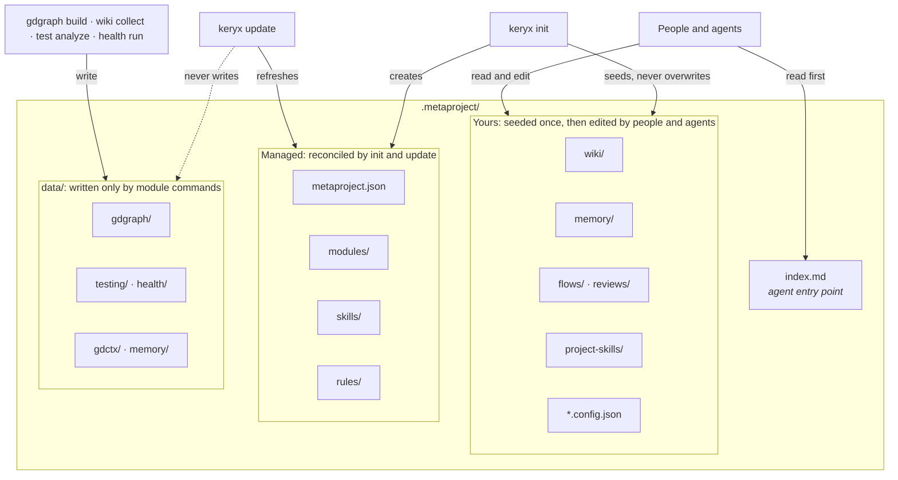

# The Metaproject

The Metaproject is the `.metaproject/` directory that `keryx init` creates in
your repository. It holds what a person or an agent needs to know to work on the
project and cannot see in the code alone: how the code fits together, why it is
the way it is, how to work on it, and what is being worked on now. It is
committed with the code.

## Why repository context is versioned

An agent that keeps its knowledge in its own session loses it when the session
ends, and a team that keeps it in a hosted tool cannot review it next to the
change that made it true. Putting it in the repository gives it the properties
code already has:

- **Reviewable.** A new decision, wiki page or acceptance criterion arrives as a
  diff in a pull request, next to the code it describes.
- **Shared.** Everyone who clones the repository, and every agent that reads it,
  starts from the same context. Nothing depends on one person's account.
- **Historical.** `git log` shows when a decision was recorded and what the code
  looked like then.
- **Offline.** Reading the context needs no service and no network.

The cost is real: generated files change when the code changes, and prose can
go stale. Keryx answers both with explicit freshness checks (`keryx doctor`,
`keryx sync`, `keryx wiki freshness`) rather than by hiding the files.

## Three kinds of files

- **Yours.** Wiki pages, memory entries, flow and review packages, project
  skills and module configuration. Keryx creates them from templates once and
  then protects them: generated wiki drafts are only refreshed while nobody has
  edited them, and a flow's state file is written only by `keryx flow` commands.
- **Managed.** The manifest, module descriptions, bundled skills and the
  routing files. `keryx init` writes them and `keryx update` brings them up to
  date with the installed version. Inside files you own, Keryx writes only
  between marked blocks, so the prose around them survives.
- **Generated data.** Everything under `data/`, written by module commands such
  as `keryx gdgraph build`. `keryx update` never writes here, which is why it is
  safe to run on a workspace full of accumulated knowledge.

## What gets committed

`keryx init` writes its ignore rules to `.git/info/exclude`, not to your
`.gitignore`, so the tracked ignore file stays yours.

| Committed | Ignored |
|---|---|
| `index.md`, `routing.md`, `metaproject.json`, `*.config.json` | `runtime/` (local clones, caches) |
| `wiki/`, `memory/`, `flows/`, `reviews/`, `project-skills/` | raw logs, storage and query caches under `data/` |
| `rules/`, `skills/`, `modules/`, `hooks/` | memory indexes and embeddings |
| graph summary, testing context, wiki index | latest health, testing and security reports |
| `keryx-dashboard.html`, `assets.lock.json` | learning observations and candidates, retention state |

The managed block in `.git/info/exclude` is the full, current list.

Some files outside `.metaproject/` belong to the same system:

| File | Committed | What it is |
|---|---|---|
| `.keryx/mcp-servers.json` | yes | MCP servers shared with the team (started only after each person trusts them) |
| `.keryx/sandbox-policy.json` | yes | Non-secret sandbox policy for the project |
| Per-developer agent instruction files | no | A short block that points agents at `.metaproject/index.md` |
| `.git/hooks/*` | no | Managed blocks that keep the graph and other layers fresh |

The per-developer files are the default so that adding Keryx does not change
your team's tracked agent instructions. You can switch an entry to the shared
files in `metaproject.json`; see
[Workspace and lifecycle](../workspace-and-lifecycle.md#where-the-block-goes-local-and-shared-scope).

## The modules

Each module owns one part of the workspace. `keryx modules` lists them and
turns them on or off.

| Module | Command | Holds | Default |
|---|---|---|---|
| `gdgraph` | `keryx gdgraph` | code dependency graph, optional symbol graph | on |
| `gdctx` | `keryx ctx` | compact command, search and read output with raw logs | on |
| `gdwiki` | `keryx wiki` | architecture, domain and decision pages | on |
| `gdskills` | `keryx skills` | bundled and project skills for agents | on |
| `health` | `keryx health` | quality signals and the health gate | on |
| `testing` | `keryx test` | test stack, related tests, test reports | on |
| `memory` | `keryx memory` | decisions, lessons, constraints | on |
| `tasks` | `keryx flow` | flow packages: criteria, tasks, journal, gates | on |
| `security` | `keryx security` | scanning policy, incidents, hooks | on |
| `mcp` | `keryx serve-mcp`, `keryx integrate` | the workspace as an MCP server | off |
| `sac` | `keryx workspace` | Shared Agent Context across sessions (experimental) | off |

The [Modules](../modules/project-knowledge.md) section has a page per area.

## How agents find their way in

Agents do not load the whole directory. They read `.metaproject/index.md`, a
short table that maps a need ("what depends on this file", "past decisions") to
the command or page that answers it, and open more only when the task needs it.
`routing.md` holds the full module map for when the index is not enough.

Agents reach that index in one of four ways:

1. The routing block in their instruction file tells them to read it first.
2. A hook installed by `keryx integrations install` injects a short orientation
   at the start of each turn, for agents that support it.
3. `keryx serve-mcp` serves the same content over MCP.
4. `keryx shell` reads it directly.

## Lifecycle

| Command | What it does to `.metaproject/` |
|---|---|
| `keryx init` | Creates it, or reconciles an existing one. Safe to re-run. |
| `keryx update` | Refreshes managed files after an upgrade. Never writes `data/` or your files. |
| `keryx sync` | Reports which generated layers are behind the code; `--apply` rebuilds them. |
| `keryx modules enable <name>` | Adds a module and scaffolds its files. |
| `keryx standard validate` | Checks the workspace against its contract. |

## What it is not

- **Not a cache.** Deleting `.metaproject/` deletes your wiki, memory and flow
  history. Generated data can be rebuilt; the rest cannot.
- **Not a secret store.** Credentials live in your per-user config directory,
  never in the repository. See the [security model](security-model.md).
- **Not required reading for every task.** The index exists so that an agent
  reads the one page it needs.

## Reference

- [Workspace and lifecycle](../workspace-and-lifecycle.md): the full layout and the `init`/`update` contract.
- [Module reference](../modules.md): every module's files and commands.
- [Built with Keryx](../project/built-with-keryx.md): this repository's own `.metaproject/`, as a worked example.
