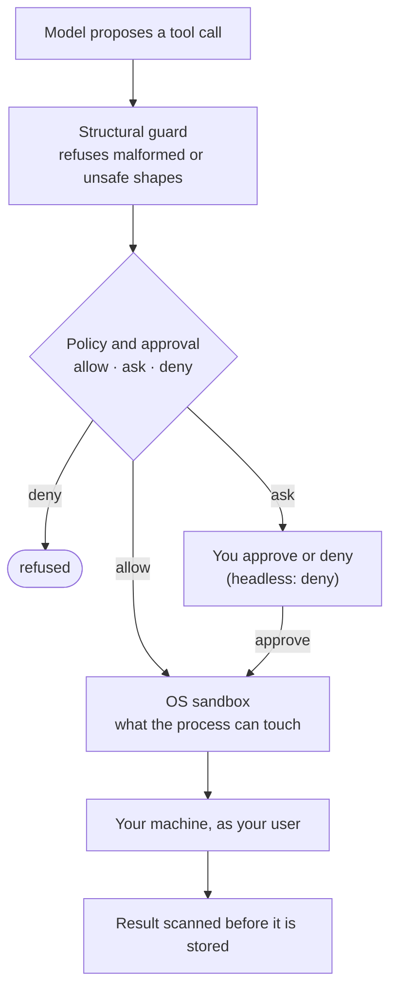

# Security model

Keryx gives a model the ability to read your code and run commands on your
machine. This page states what it protects against, how each control works, and
what it does not protect. Read the last section before you rely on any of it.

## What is at stake

| Asset | Where it is |
|---|---|
| Your source code and git history | the repository, including `.metaproject/` |
| Your user account | every command the agent runs, runs as you |
| Credentials | provider keys and logins in the per-user config directory, keys in your environment, cloud and SSH credentials on the machine |
| The network | model providers, web search, MCP servers, anything a command can reach |

## Threats Keryx is designed for

| Threat | Main control |
|---|---|
| A model runs a destructive or unwanted command | Approval before every shell command and change (`ask` mode), policy engine, read-only `/plan` |
| A command reaches files or hosts it should not | OS sandbox (opt-in for the shell, enforced for contained runs) |
| A cloned repository runs code or sets keys before Keryx starts | Environment isolation: no project `.env` or `bunfig.toml` |
| A committed config starts a program you never reviewed | Committed MCP servers start only after `keryx mcp trust` |
| Secrets leak into stored output or commits | Secret and PII scanning, redaction, pre-push guard |
| Private code goes to a provider you did not choose to trust | The `/external` block list |
| A remote caller gains more authority than a local user | Remote entry off by default, loopback-only, authenticated, never weaker than local policy |
| An agent grants itself authority | Credential files are never auto-approved; modes are set only by you |

## Layers

The policy layer decides **whether** a command may start. The sandbox decides
**what** a running command can reach. They are independent: a command you
approve still runs inside the sandbox if the sandbox is on, and a sandbox does
not replace the approval.

## Command execution and approval

**The interactive shell.** `keryx shell` asks before it runs a shell command,
spawns a subagent or calls a tool that declares itself destructive. That is the
default `ask` mode. Two other modes trade confirmation for speed:

| Mode | Asks before |
|---|---|
| `ask` (default) | every shell command, subagent and destructive tool call |
| `trust` | destructive calls only (`rm -rf`, force-push and similar, by a command classifier) |
| `auto` | nothing, except the floor below; entering it needs an explicit confirmation |

Three rules hold in every mode:

- A command that touches Keryx's own credential or permission files is never
  auto-approved.
- Only you change the mode, in the running session. No tool output, model reply
  or remote caller can set it.
- `/plan on` makes the session read-only: every non-read tool call is refused,
  with no prompt.

[Choose an approval mode](../guides/permission-modes.md) has the details.

**Non-interactive paths.** `keryx harness run`, `keryx harness exec`,
`keryx serve` and the MCP server do not use permission modes. They use the
policy engine directly: each action gets `allow`, `ask` or `deny` by its risk
class (read, write, shell, network, credential, delegate, destructive). A deny
is final, an approval covers exactly one action, and an `ask` with nobody to
answer becomes a deny. The policy engine also refuses any write to a flow's
state file, even with an approval. See [The agent harness](../harness.md#the-policy-engine-three-answers-not-two).

**Subagents** run under a narrower policy and credential scope than the parent,
within a shared budget.

## OS sandbox

The sandbox limits what a process can reach, whatever it was approved to do.

| Capability | macOS | Linux | Windows |
|---|---|---|---|
| Filesystem boundaries (workspace write, secret read-deny) | yes (Seatbelt) | yes (`bubblewrap`) | no |
| Network off | yes | yes | no |
| Network restricted to a domain allowlist | yes | refuses to run | no |
| Credential masking, TLS termination | yes | refuses to run | no |

Two behaviours matter more than the table:

- **A requested sandbox is refused, not downgraded.** If the launcher is
  missing or a requested restriction is not available on the platform, the run
  fails with a reason instead of running unsandboxed. On Linux a domain
  allowlist never becomes full network access.
  `KERYX_SANDBOX_ALLOW_UNSANDBOXED` lets a run proceed only when the launcher
  is missing, as a choice you make knowingly.
- **Shell commands in `keryx shell` are not sandboxed by default.** The approval
  prompt is the main control. `KERYX_SANDBOX_SHELL=workspace` limits their
  writes to the project and temporary directories and denies reads of secret
  paths; `KERYX_SANDBOX_SHELL=strict` also turns the network off.
  `keryx harness exec` refuses to start a real process at all without
  `--allow-real-subprocess`.

`keryx sandbox status` prints what is available on your machine.
[Run an agent without giving it your machine](../guides/contain-an-agent.md)
walks through contained runs.

## Secrets and redaction

- **Detection.** The security module scans for secrets, personal data and
  prompt injection with deterministic rules and entropy analysis. There is no
  bundled machine-learning classifier. `keryx security scan <path>` runs it on
  demand, and the detectors are measured in CI against a labelled corpus
  (`keryx security eval --corpus all`).
- **Before storage.** Compact output from `keryx ctx` is redacted before the raw
  log is written. The harness scans every recorded tool result before it is
  stored as evidence; a result that fails the scan is not stored at all.
- **Before commits and pushes.** `keryx init` installs a pre-push guard and,
  for agents that support it, hooks that check the agent's input and output.
  `keryx integrations install` adds them to more agents.
- **Credentials at rest.** Provider keys, subscription logins, MCP tokens and
  the project registry live in one per-user config directory
  (`~/.local/share/keryx/` on macOS and Linux), written owner-only (mode 0600).
  They are never written into the repository.
- **Credentials in child processes.** A shell command the agent runs gets your
  environment minus the provider keys Keryx saved, so an agent that runs `env`
  does not see them (`KERYX_SHELL_PASS_SAVED_KEYS=1` passes them through). MCP servers and external agent CLIs also start without Keryx's
  own credentials.

## Environment isolation

A cloned repository is not consent to run its code. Bun normally loads `.env`
and `bunfig.toml` from the current directory on every start, which would let a
repository set your provider keys, change `KERYX_*` settings or run a preload
script before Keryx starts. The installed `keryx` launcher starts Bun with
`--no-env-file --config=/dev/null`, so neither happens.

When Keryx runs from a source checkout (`bun src/cli.ts …`) the launcher is
bypassed, and a weaker guard applies: Keryx restarts itself once with the safe
flags and strips every variable named in the directory's `.env*` files, plus
`BUN_OPTIONS`, `NODE_OPTIONS` and `BUN_CONFIG_*`. A `bunfig.toml` preload has
already run by then, so treat `bun src/cli.ts` in an untrusted checkout as
unsafe. If a `.env*` file cannot be read in full, Keryx refuses to start (exit
code 78) rather than guess.

To use a project `.env` on purpose, see
[Troubleshooting](../getting-started/troubleshooting.md#variables-from-the-project-env-are-not-used).

## Network egress and `/external`

The model sees what the agent reads. Prompts, the files and command output the
agent pulls into a turn, and diffs go to the provider you chose. Pick the
provider accordingly; a [local model](../guides/use-a-local-model.md) keeps
everything on your machine.

`/external off` (or `keryx external off`) blocks private work from going to
providers and models on a block list you can edit. The default list covers
providers whose terms allow keeping or training on prompts, free model tiers
with unaudited logging, and an external review service. `keryx external list`
prints the effective list and where each entry came from. See
[Keep private work in-house](../guides/keep-private-work-in-house.md).

Commands the agent runs reach the network unless the sandbox is on with network
off or restricted.

## MCP servers

A project can commit a list of MCP servers in `.keryx/mcp-servers.json`. That
file is code someone else wrote, so Keryx does not start a project server until
you run `keryx mcp trust <name>`. The approval is bound to the exact command; a
change to it needs a new approval. Your own user-scope servers need none.

Every MCP tool call counts as destructive, so it asks even in `trust` mode. You
can trust one exact tool for one session, never a whole server, and never a tool
its server marks destructive. Remote server credentials come from environment
variables; Keryx refuses to dial when one is unset and does not follow
redirects. See [MCP servers in the shell](../modules/mcp-servers.md).

In the other direction, `keryx serve-mcp` publishes the workspace over stdio.
Its HTTP transport binds to localhost and needs a separate capability switch,
and `--read-only` hides every tool that writes.

## Remote entry

`keryx serve` lets a bot or a browser drive turns over HTTP. It is off until
you configure it, binds to loopback unless you pass
`--acknowledge-non-loopback`, and authenticates every request before routing,
so an unauthenticated caller cannot tell a real path from a missing one. Each
turn's policy profile is compared with the local one and refused if weaker. An
`ask` becomes a pending approval that you answer once, or that denies at expiry.
Prompts are scanned as untrusted input; a prompt with an injection or secret
finding creates no turn. See [Drive keryx from a bot](../guides/drive-keryx-remotely.md).

## Install integrity

The standalone binary installer checks the download against the digest GitHub
records for the release and refuses on a mismatch. npm releases are published
with provenance. Keryx has no required runtime dependencies; the MCP SDK, the
terminal UI library and the parser for the symbol graph are optional.

## What is not protected

!!! warning "Read this before you rely on the controls above"
    These gaps are known and stated on purpose.

- **An approved command runs as you.** Without the sandbox, an approved shell
  command can do anything your account can. In `trust` and `auto` mode that
  includes commands you never saw. Use `auto` only in a throwaway checkout or a
  contained environment.
- **Command classification is text analysis.** It catches common destructive
  forms, but a same-user shell can spell a command so no text check recognises
  it (a variable, a script file, an interpreter one-liner). The approval and the
  sandbox are the boundary, not the classifier.
- **Linux has no domain allowlist or credential masking**, and Windows has no
  sandbox at all.
- **Whatever reaches the model reaches the provider.** Redaction applies to
  what Keryx stores and to remote-entry output, not to the prompt a turn sends.
  A remote prompt is scanned but forwarded unredacted.
- **Session transcripts are stored per project on disk.** Treat them as
  containing whatever the agent read.
- **MCP servers and external agent CLIs are programs you run.** Trust controls
  when they start, not what they do once running.
- **Detection is rule-based.** Secret, PII and injection detection is
  deterministic and has false negatives; it is measured, not perfect.
- **Keryx is pre-1.0.** The controls are tested, but the code changes often.

## Report a vulnerability

Report security problems privately as described in
[SECURITY.md](https://github.com/MrCipherSmith/keryx/blob/main/SECURITY.md),
not in a public issue.
