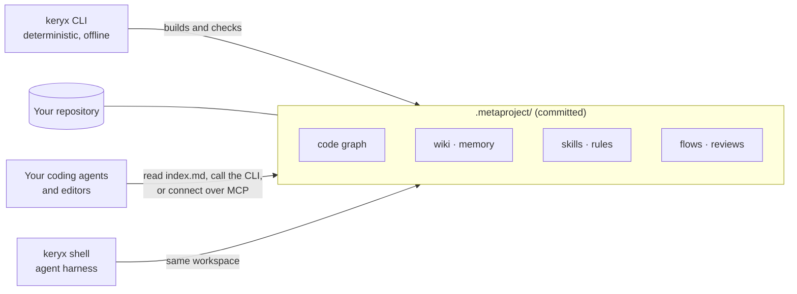

# Keryx in five minutes

Coding agents start every task knowing nothing about your project. They re-read
files to find structure, lose what they learned when the session ends, and leave
no record of why a change was made. Keryx keeps that knowledge in the
repository, in a form both people and agents can read, and keeps it current.

## The model

Three parts:

1. **The workspace.** `keryx init` creates `.metaproject/` in your repository.
   It holds the project's working knowledge as Markdown and JSON, and it is
   committed with the code, so it is reviewed in pull requests and shared by
   everyone who clones the repository.
2. **The CLI.** `keryx` builds and maintains the workspace: it scans code,
   builds the graph, drafts wiki pages, checks links, records state changes.
   These operations are deterministic and need no model and no network.
3. **The delivery.** Agents reach the workspace through plain files (a routing
   block points them at `.metaproject/index.md`), through the CLI, through
   hooks installed into the agent, or through an MCP server. Keryx also has
   its own agent, `keryx shell`, which works on the same workspace.

## The nouns

| Term | What it is |
|---|---|
| Module | One area of the workspace, switched on or off with `keryx modules`. Nine are on by default (graph, compact output, wiki, skills, health, testing, memory, tasks, security); two more are opt-in (MCP server, Shared Agent Context). |
| Code graph | Which file imports which. Answers "what depends on this file" without reading the code. |
| Wiki | Architecture and domain pages, drafted from the code and finished by people or agents. |
| Memory | Decisions, lessons and constraints that the code does not show. Entries start as drafts and are accepted explicitly. |
| Compact output | `keryx ctx` runs searches and commands, returns a short summary and keeps the full output in a log, so an agent's context is not flooded. |
| Skills and rules | Working instructions for agents, bundled and project-specific, plus your existing agent instruction files imported as rules. |
| Flow | A managed piece of work: a description, acceptance criteria that are frozen before work starts, tasks, a journal and completion gates. |
| Review package | A review with a durable record: coverage, findings and the decision on each finding. |
| Shell | `keryx shell`, an interactive agent with sessions, slash commands, permission modes and an OS sandbox. |
| Provider | The model service the shell uses: a hosted API, a subscription, or a local model. |

## How a task uses it

1. The agent starts and reads `.metaproject/index.md`, a short routing table.
2. Before changing a file it asks the graph what depends on that file, and reads
   the wiki page and accepted memory for that area.
3. It searches and runs commands through `keryx ctx`, which keeps output small.
4. For managed work it opens a flow; the frozen criteria say when the work is
   done, and the completion gates check them.
5. What it learns goes back into the wiki or memory, as a reviewable diff.

The graph and wiki stay current through git hooks and `keryx sync`, which
reports what changed in the code since each layer was last built.

## What Keryx is not

- **Not a hosted service.** There is no server and no account. Everything is
  files in your repository and one directory of per-user settings.
- **Not a model.** The core runs with no model at all. A few commands add
  model-written text on top, and they say so when no provider is configured.
  See [Limitations](../limitations.md#commands-that-need-a-model-credential).
- **Not a replacement for your agent.** It gives the agents you already use a
  shared, versioned context. The shell is an option, not a requirement.
- **Not finished.** Keryx is pre-1.0 and changes often. See
  [Project status](../project/status.md).

## Reference

- [`shell`](../cli-reference.md#shell), [`gdgraph`](../cli-reference.md#gdgraph), [`wiki`](../cli-reference.md#wiki) and [`flow`](../cli-reference.md#flow) in the CLI reference.
- [Reference index](../reference/index.md): configuration and every other reference page.

## Where to go next

| You want to… | Read |
|---|---|
| Try it on a project | [Quickstart](quickstart.md) |
| Understand the workspace in depth | [The Metaproject](../concepts/metaproject.md) |
| Know what is protected and what is not | [Security model](../concepts/security-model.md) |
| See how the code is organised | [Architecture](../architecture.md) |
| Connect the agents you already use | [Connect your agents](../modules/integrations.md) |
