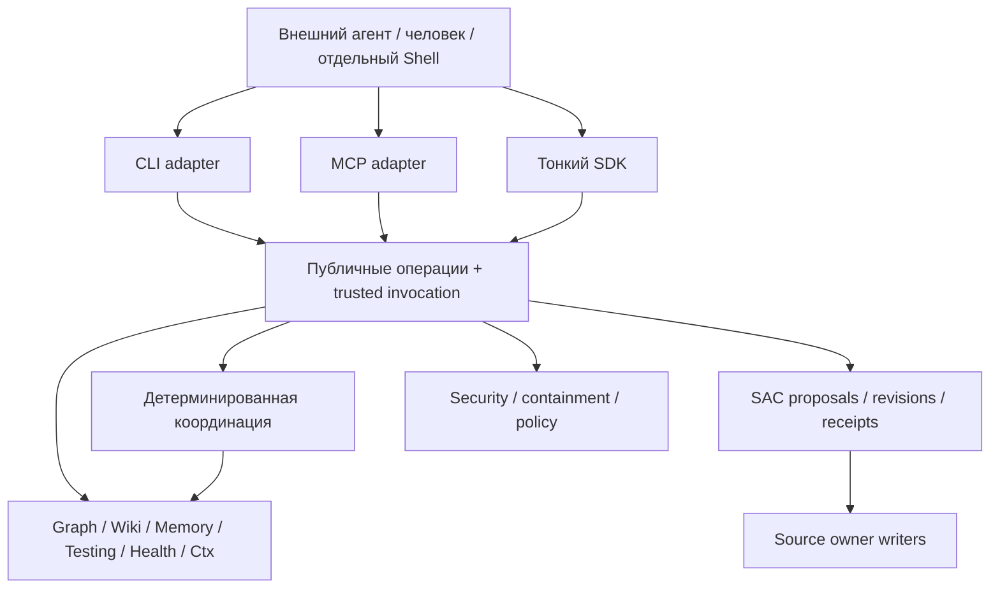

# Спецификация ядра и публичных операций
Version: 0.1.3

Статус: **spec ready**. Технические контракты — **proposed**; их runtime-реализация этим пакетом не подтверждается.

## 1. Identity, статус и граница реализации

Package ID: `keryx-agent-first-core`. Статус: **spec ready, proposed target contracts**. Core — существующие детерминированные модули и сервисы с согласованным публичным facade; отдельный новый движок не нужен. Приведённые ниже operation IDs и JSON являются **предлагаемым wire-контрактом v1**, не существующими командами. Точные флаги CLI закрепляются в release mapping перед реализацией.

На базе `0bc6418fa1a038f8ec909cf949fecba077acf9a4` уже есть lexical `gdgraph find`, SAC proposals/revisions, owner writers, memory lifecycle, wiki freshness/Reference и генераторы компактного gate. Пробелы — согласованность гарантий, межмодульный lifecycle и расширение section evidence. `rules sync/distill` ещё используют полный index writer. Исторические исследования не являются доказательством runtime этой версии; здесь не заявляется прохождение нового полного test/health gate.

## 2. Ownership и направления импортов

Владельцы не импортируют CLI/MCP/Shell. Coordination может читать несколько owners, но не обходить их guarded writes. Utilities содержат независимые типы, parsing, hashing, paths; narration и model adapters относятся к клиенту, server routing — к своему adapter. Общий разбор wiki metadata/describes/provenance выносится ниже collect и freshness, чтобы разорвать цикл без копирования логики. Import-policy проверяет реальные направления, не число циклов вообще.

В core нет provider registry, выбора модели, credentials, LLM-вызовов, обязательного embedding runtime. Capability для парсеров локальна и не запускает загрузку по query. Shell может находиться в том же репозитории в отдельном пакете; его отсутствие не препятствует core-only install/build/smoke.

## 3. Единая оболочка ответа

Схемы: [common](schemas/common.schema.json), [operation response](schemas/operation-response.schema.json). Пример: [response](examples/operation-response.json). Оболочка содержит `contractVersion`, `operation`, `status`, `scope`, `sources`, `completeness`, `redaction`, при применимости `freshness`, `budget`, `lossManifest`, `continuations`, `result` либо `error`.

| Ось | Значения и смысл |
|---|---|
| status | `ok`: операция выполнена; `partial`: разрешённая частичная выдача/неатомарный batch; `error`: результата операции нет. Это не health PASS |
| freshness | `fresh`, `stale`, `unknown` относительно указанного snapshot; проверка отсутствует/сломана → unknown с причиной |
| completeness | `complete`, `partial`, `unknown`; описывает заявленную область, а не доказательство отсутствия всех возможных связей |
| redaction | `unchanged` или `redacted` с безопасными причинами; redacted допустим при сохранении operation schema |
| error.code | Стабильный код, безопасное объяснение, разрешённые next actions. Stack/raw secret/закрытый ID не включаются |

Результат с нулём элементов не стирает coverage. `ok` с `completeness=complete` означает завершение поддерживаемого запроса в заявленном scope, не истинность интерпретации. Freshness не обязана присутствовать у help/parser; если операция зависит от изменяемого source, отсутствие freshness запрещено service validator. Ошибка с частными деталями нормализуется одинаково для denied и unknown скрытого объекта.

**Обязательные различия M03:** `target-not-indexed` — target не найден в разрешённом snapshot; `index-incomplete` — индекс не позволяет ответить; `no-match` — завершённый поддерживаемый поиск без совпадений; `insufficient-evidence` — кандидаты есть, но недостаточны для заявленного контекста. `version-conflict`, `snapshot-unavailable`, `capability-unavailable`, `budget-exceeded`, `handle-invalid`, `handle-expired`, `format-unsafe`, `invalid-input` обозначают отдельные причины. Нормализатор транспорта сохраняет коды. Численный lexical score называется ranking score, не вероятностью правильности.

## 4. Scope, snapshot и capability

Scope содержит проект, checkout и при необходимости task/workspace. Значения берутся из доверенного resolver и сравниваются со scope запроса; JSON не выдаёт доступ. Snapshot включает revision, релевантный dirty fingerprint, config fingerprint и версию producer. Revision без dirty/untracked inventory недостаточна. File hash — fingerprint, не подтверждение смысловой истинности.

Graph/testing перед query проверяют root identity, config и релевантный набор файлов. При изменении строят новый disposable snapshot и публикуют указатель только после завершения. Query читает один snapshot; смешивать старые edges с новыми nodes запрещено. При конкурентном изменении входов snapshot не маркируется fresh: retry в рамках лимита либо partial/unknown. Валидный snapshot переиспользуется. Ошибка refresh позволяет вернуть старый справочный snapshot с явным stale/unknown, но не доказывает отсутствие impact/tests.

Testing discovery проверяет canonical path и принадлежность checkout, Git metadata вложенных worktrees, excludes dependency/generated/cache, учитывает configured test roots. Обычный monorepo package внутри checkout остаётся допустимым. Каждый selected path проверяется перед выдачей; naming heuristic явно отличается от import-derived selection.

Symbols capability публикует runtime и grammar версии, checksum/source verification, покрытые языки/файлы, parse errors и `available/partial/unavailable`. `requireSymbols=true` отказывает при отсутствии требуемого покрытия; file-level fallback разрешён только при явно допускающем его запросе. Явная install-операция предлагает нужные языки, проверяет совместимость/источник и повторно использует проверенный cache; offline query ничего не устанавливает. Tree-sitter не заявляется полноценным type-aware resolver.

## 5. Graph и составной контекст

Graph edge сохраняет `runtime-static`, `type-only`, `dynamic`, `unknown`. Mixed import получает runtime-static, если есть исполняемая часть, и сохраняет type usage metadata. Unknown не угадывается. Load-order cycle query использует только runtime-static; type/dynamic/unknown выводятся отдельно. Impact включает type-only consumers при изменении типов. Runtime cycle — сигнал для исследования, не безусловный FAIL.

Repomap `dependency` идёт к зависимостям seed, `impact` — к потребителям и связанным tests, `balanced` — ограниченная композиция. Default для change intent — impact; без seed — явно общий overview. Selection детерминирован, показывает reason (`seed`, `dependency`, `consumer`, `test`, `wiki-binding`). Zero-score не добавляет ballast. Fixtures/generated по умолчанию не вытесняют production, но явно указанный target не отбрасывается. Seed и обязательные ограничения защищены; если они не помещаются целиком, `budget-exceeded`, а не успех с урезанным обязательным контекстом.

`context.change` (предлагаемый ID) принимает description либо seed, режим, разрешённые sources и budget. Description использует существующий `gdgraph find` по именам/путям/символам; wiki lexical candidates добавляются через явные section→code bindings; затем bounded affected. Не запускает все подсистемы без нужды. При no-match возвращает ограниченный допустимый следующий шаг к text search. Глубина и quota related tests задаются конфигурацией, калибруются на corpus; универсального процента до измерения нет.

## 6. Ctx, бюджет и адресное раскрытие

Стратегия определяется реальным форматом, не расширением вслепую: code → signatures/imports/запрошенные ranges; Markdown → headings/содержательные sections/ограничения; JSON → schema-valid summary со своим type; logs → exit/status/failures/warnings. Маленький ввод в пределах бюджета возвращается без лишней обвязки. Parser failure даёт ограниченный fallback с причиной и incomplete, не пустой успешный outline.

Вопрос — параметр deterministic matching/ranking, не повод вызвать модель. Критические структурные поля (`exitCode`, число failed tests, error records, обязательные contract keys) сверяются до/после; при потере compression ослабляется, затем при необходимости выдаётся error/partial. Проверка полей не доказывает сохранение всех смысловых условий прозы. Обязательные linked caveats рассматриваются как один неделимый item.

Бюджет измеряется в UTF-8 bytes, количестве items и опционально `estimatedTokens` с явно названным estimator/version. Estimator не знает провайдера и не обещает billing. Общий лимит включает envelope, evidence, manifest и continuations; required envelope reserve проверяется до сборки. `maxBytes` — верхняя граница, не цель заполнения. Если сокращён сам manifest, `truncated=true`; запрещённый источник не появляется в нём как ID или счётчик конкретных объектов. Можно показать общий факт применения access policy, не раскрывая existence.

Continuation связывает operation, opaque handle, sourceVersion, scope и expiry. Разрешённый диапазон раскрывается без повторного поиска, с повторной проверкой доступа и версии; при drift ответ `version-conflict` либо предлагает новое представление, но не молча читает другую версию. Handle не bearer-capability. Delta от прошлого чтения допускается только при explicit base snapshot и consumer isolation; нет базы → ordinary view с причиной. Consumer history хранится лишь opt-in, чистое чтение не пишет её. Disposable cache допустим и указан в operation descriptor отдельно от recording.

## 7. Поверхность и конфигурация

Ниже **предлагаемые operation IDs**, а не инструкции запуска существующего CLI. CLI флаги и MCP names определяются compatibility map. SDK использует эти же descriptors, validators и services; он не отдельная реализация.

| ID | Вход | Выход/эффект |
|---|---|---|
| `operations.list`, `operations.describe` | capability или operation | Малый каталог, schema, пример, risk, cache/recording semantics |
| `graph.find`, `graph.affected` | query/seed, mode, scope, budget | Candidates/edges с reasons и snapshot |
| `wiki.search`, `wiki.readSection` | query либо section/version/range | [Wiki evidence](schemas/wiki-evidence.schema.json), без model answer |
| `context.change`, `context.expand` | intent/handle, budget | Bounded composite + loss manifest |
| `knowledge.preview`, `knowledge.apply` | [Changeset](schemas/change-set.schema.json) | SAC preview, validation, CAS и receipt |
| `context.handoff`, `context.resume` | [Handoff](schemas/handoff.schema.json) либо его ref | Пакет либо drift относительно него; не Flow mutation |
| `knowledge.forget.preview`, `knowledge.forget.apply` | Owner locators и policy binding | Scope очистки, tombstones, per-store verification |
| `operations.batch` | [Batch](schemas/batch.schema.json) | DAG результатов с per-step status, не общая транзакция |

Предлагаемая конфигурация расширяет существующие owner configs: `contractVersion`, `budgets`, `cache.refresh=on-demand`, `recording.enabled=false`, `concurrency`, `retention`, `rankingProfileRef`, `requiredChecks`, `optionalChecks`. Дефолты численных лимитов фиксируются после calibration в versioned profile до реализации; запрос без применимого profile даёт `configuration-incomplete`, а не unlimited. Core config не содержит model/provider/credentials. Настройка `enabled=false` не импортирует optional client dependencies. Runtime config и manifest должны сообщать поддерживаемый contractVersion; неподдержанная major отвергается.

## 8. Batch, handles и связанные writes

Batch принимает acyclic steps со stable IDs, operation allowlist, JSON arguments и явными dependencies. Independent steps запускаются с bounded concurrency; dependent step — после успешных нужных inputs. `onFailure=stop-dependent` оставляет независимые ветви; `stop-all` отменяет ещё не запущенные и пробует cancel in-flight. Уже завершённые ordinary операции не откатываются. Итог показывает `ok/error/skipped/cancelled` по каждому шагу; один failed step не превращается в общий ok.

Предлагаемая ссылка между steps задаётся объектом `{fromStep, pointer}` внутри arguments. `fromStep` обязан присутствовать в dependsOn; pointer — JSON Pointer в нормализованный разрешённый output успешного step. Неизвестный путь, wrong type или source, не подходящий input schema следующей операции, даёт typed error; строковая подстановка в shell не выполняется. Operation-specific argument schemas проверяются после resolve.

Reference на handle повторно проверяет scope/access/version/expiry при resolve. Handle хранит owner snapshot, policy binding и managed derivative links для forget. Project/checkout mismatch даёт безопасный `handle-invalid`, не чужой content. Batch принимает только зарегистрированные deterministic операции; произвольный код выполняется во внешней среде, не внутри универсального core sandbox. Сначала release с чтением/поиском, затем guarded writes. Нельзя распределять один связанный knowledge change по независимым steps: он передаётся целиком в `knowledge.apply` через SAC protocol [lifecycle](artifact-lifecycle.md).

## 9. Acceptance и schema boundary

Нормативные сценарии: [AC-09..14, AC-16, AC-20, AC-30, AC-32, AC-M03..M05](decision-traceability.md). JSON Schema проверяет форму, closed enums и локальные cross-field ограничения. Access, версии живого source, budget accounting, атомарность, DAG acyclicity, reference binding и scope сравниваются service validators; schema-valid не означает authorized/consistent.

Спецификация явно ссылается на все схемы: [common](schemas/common.schema.json), [response](schemas/operation-response.schema.json), [wiki evidence](schemas/wiki-evidence.schema.json), [changeset](schemas/change-set.schema.json), [handoff](schemas/handoff.schema.json), [batch](schemas/batch.schema.json). Positive examples: [wiki](examples/wiki-evidence.json), [response](examples/operation-response.json), [changeset](examples/change-set.json), [handoff](examples/handoff.json), [batch](examples/batch.json). Их значения синтетические; это примеры предложенного контракта, не runtime traces.

Набор [validation cases](examples/validation-cases.json) содержит schema-negative mutations и schema-valid service-negative сценарии; поле `serviceOutcome` задаёт ожидаемую будущую проверку, не результат уже выполненного runtime.

Constraint отдельно хранит `sourceStatus`, `source` (object/null) и `unknownReason` при неизвестном источнике. Недоступное основание не требует выдуманной ссылки и не удаляет ограничение; unknown не подтверждает разрешение. Service validator также проверяет `endLine >= startLine`, уникальность step IDs и acyclic DAG; это явные schema-valid negative cases.
