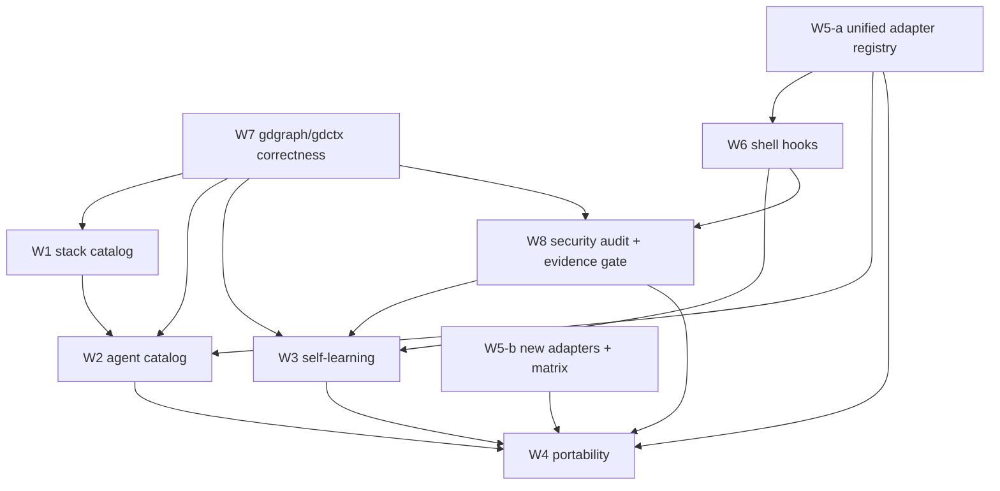

# Keryx Agent Platform Expansion — Specification
Version: 0.1.3

## Module identity

Package ID: `keryx-agent-platform-expansion`. It is a documentation and
orchestration contract for eight workstreams (W1–W8). It defines no runtime of
its own; runtime state is owned entirely by each workstream's own
implementation once a Flow is started for it. Everything described here as
existing is backed by a code-path citation; everything else is `planned`.

## Storage structure

Tree of directories this program's workstreams introduce or extend. Paths
marked `(new)` do not exist today; paths marked `(extends)` add to an existing
tree.

```text
.metaproject/
  agents/                      (new, W2)      canonical agent-definition .md files
  hooks.json                   (new, W6)      project-scope keryx shell hook config
  security-audit-baseline.json (new, W8)      accepted-finding baseline for keryx security audit-harness
  security.config.json         (extends)      adds impactEvidence.enabled kill switch (W8)
  data/
    stack/
      stack.json               (new, W1)      deterministic stack-detection output
    skills/
      install-state/
        <target>.json          (new, W1)      per-target install-state record
      stocktake/               (new, W1)      periodic stocktake run output
    learning/
      observations/            (new, W3)      bounded, redacted, TTL'd JSONL from hooks
      candidates/               (new, W3)      learned-pattern candidate records
    gdgraph/                   (extends)      existing graph artifacts; the freshness self-check already exists (`src/gdgraph/staleness.ts`, `src/commands/gdgraph.ts:583-593`) — W7 adds fixture coverage for it, not new output
    gdskills/                  (extends)      existing skill proposals (W3 reuses learn.ts's LearningProposal shape)
  rules/
    reviewers/                 (new, W3)      per-reviewer profile rules, <reviewer-id>.mdc
  skills/
    catalog.md                 (extends)      W1 stack packs add entries via existing catalog governance

src/gdskills/bundled/
  stacks/<stack-id>/           (new, W1)      per-stack pack source (rules + skills + agent refs)

~/.keryx/                      (new, W4)      user-scope store
  agents/                                     user-scope agent definitions
  skills/                                     user-scope / personal skills
  learning/
    patterns/<id>.json                        user-scope learned-pattern records, status: candidate until accepted at user scope (learned-pattern.schema.json). `keryx learn promote` is the only path that creates a user-scope pattern from project-scope evidence; `keryx bundle import` may transport an already-`scope: user` record here, never changes its scope, and always writes it at `status: candidate`
    index.json                                cross-project evidence index keyed by pattern id -> per-identity entries, written only by `keryx learn accept`
  memory/<folder>/*.md                        cross-harness memory handoff entries (W4)
  hooks.json                   (new, W6)      user-scope keryx shell hook config
  bundles/
    applied-state.json                        record of applied W4 portable bundles
    (cache/)                                  imported/exported W4 portable bundles (cache)
```

Learning data under `.metaproject/data/learning/` (`observations/`,
`candidates/`) is explicitly added to `.gitignore` and to `keryx init`'s
managed ignore block by W3 (W3-AC9) — it is not covered by any existing,
broader `.metaproject/data/` ignore rule, which today ignores only specific
subpaths (`data/**/raw/`, `data/gdctx/artifacts/`, `data/memory/index/`, …).

Per-harness directories W5 adapters read/write (`.claude/`, `.codex/`,
`.cursor/`, `.windsurf/`, `.agents/` [antigravity], `.opencode/`, plus new
targets for Gemini CLI, Kiro, and Zed) are owned by each harness's own
convention, not by Keryx; W5's specification file lists the exact paths per
adapter.

## Manifest / config shape summary

Full field-level shapes live in the schemas this program's workstreams own.
This section only summarizes intent and points to the authority:

| Concern | Schema | Owning workstream |
|---|---|---|
| Install profile → module → component plan | [`schemas/install-manifest.schema.json`](schemas/install-manifest.schema.json) | W1 |
| Canonical agent definition | [`schemas/agent-definition.schema.json`](schemas/agent-definition.schema.json) | W2 |
| Learned pattern candidate/accepted record | [`schemas/learned-pattern.schema.json`](schemas/learned-pattern.schema.json) | W3 |
| Portable bundle manifest | [`schemas/portable-bundle.schema.json`](schemas/portable-bundle.schema.json) | W4 |
| Harness capability matrix record | [`schemas/harness-capability-matrix.schema.json`](schemas/harness-capability-matrix.schema.json) | W5 |
| keryx shell hook configuration | [`schemas/hook-config.schema.json`](schemas/hook-config.schema.json) | W6 |
| Harness-config security audit report | [`schemas/harness-audit-report.schema.json`](schemas/harness-audit-report.schema.json) | W8 |

All seven schemas are JSON Schema draft 2020-12, `$id` =
`keryx://schemas/agent-platform/<name>.schema.json`, and must parse. W7
introduces no new schema — its deliverable is a defect register and benchmark
fixtures, detailed in
[workstreams/W7-graph-ctx-correctness.md](workstreams/W7-graph-ctx-correctness.md).

## Consolidated CLI surface

Every command below is `planned` unless the workstream file states otherwise
with a code-path citation.

| Command | Purpose | Owning workstream |
|---|---|---|
| `keryx stack detect` | Deterministic, offline stack detection → `stack.json` | W1 |
| `keryx skills install --profile <p> [--with/--without] [--dry-run] [--json]` | Install profile → module → component plan/apply | W1 |
| `keryx skills doctor` | Diagnose an install profile's installed state | W1 |
| `keryx skills uninstall` | Remove only Keryx-managed installed files | W1 |
| `keryx skills scout` | Pre-creation dedupe gate against existing skills | W1 |
| `keryx skills eval` | Trigger + behavior evals, pass@k | W1 |
| `keryx skills stocktake` | Periodic keep/improve/update/retire/merge verdict | W1 |
| `keryx agents list \| show \| export \| verify` | Agent-definition catalog operations | W2 |
| `keryx learn observe \| extract \| list \| review \| accept \| reject \| apply \| promote \| graduate \| prune` | Observe→extract→consent→apply→promote→graduate learning-loop operations | W3 |
| `keryx review learn --reviewer <id>` | Per-reviewer profile rule generation from review history | W3 |
| `keryx bundle export \| import \| inspect \| verify` | Portable bundle operations | W4 |
| `keryx memory handoff` | Cross-harness memory entry handoff | W4 |
| `keryx integrations install \| doctor \| uninstall \| matrix [--check] [--runtime <id>] [--surface <flag>]` | Per-host-harness surface lifecycle and capability matrix. Distinct from, and does not change, Keryx's own `keryx harness run \| exec \| extension \| wave` agent-runtime commands. | W5 |
| `keryx hooks list \| test \| validate \| enable \| disable [--user]` | keryx shell lifecycle hook configuration and diagnostics | W6 |
| `keryx ctx rg` (fix), `keryx ctx run` (fix), `keryx ctx read` (fix) | Correctness fixes to existing commands (R7.3–R7.6) | W7 |
| `keryx security audit-harness [apply --proposal <id>] [--json] [--ci]` | Harness-config security audit and separate fix-proposal apply step | W8 |
| `keryx security impact-evidence status \| test` | Inspect/dry-run the impact-evidence gate | W8 |

Each workstream file owns the exact flag/output contract for its rows.

## Shared contracts

Contracts one workstream defines and at least one other consumes. Each is
detailed in its owning workstream file; this section only records the
dependency so a reviewer can see the coupling at a glance.

- **Hook event contract (owned by W6)** — the event names, payload shape, and
  block/allow/inject-context signal (stdin JSON, exit 2 = block, stdout JSON
  decision/additionalContext) that W3's observation stage, W5's host-harness
  adapters, and W8's impact-evidence gate all emit or consume against.
  Security hooks keep their current semantics under this contract:
  `keryx.security-check-input` registers on `UserPromptSubmit` as `gate`, and
  `keryx.security-check-output` registers on `PreToolUse` `Write|Edit` as
  `gate` — W5's `security hooks install` alias maps to the prompt-gate plus
  these block surfaces, not to an observe-only surface. `keryx.impact-evidence`
  registers as `gate-advisory` by default (fail-open with a recorded warning in
  `read-only-review`/`monitored-trusted-local`, fail-closed in
  `unattended-untrusted`) and as `gate` in strict mode.
- **Harness adapter registry (owned by W5)** — the single source of per-
  harness capability flags and install/verify commands that W2's exporters,
  W4's harness-specific instruction export, and W6's ACP/serve/trigger
  support all read rather than each maintaining their own runtime list.
- **Learned-pattern record (owned by W3)** — the id/trigger/action/evidence/
  confidence/domain/scope/status/provenance shape that W1's catalog governance
  (graduation into skills) and W2's agent catalog (graduation into agents)
  both consume as their "evidence this content is warranted" input.
  `keryx learn promote` is the only path that creates a user-scope pattern
  from project-scope evidence. `keryx bundle import` may transport an
  already-`scope: user` record into `~/.keryx/learning/patterns/`; it never
  changes a record's scope and always writes it at `status: candidate`.
  `keryx learn accept` is the only command that makes any record `accepted`:
  it writes the status transition in the record's own store
  (`.metaproject/data/learning/` for `scope: project`,
  `~/.keryx/learning/patterns/` for `scope: user`) and, for a `scope: project`
  record only, appends one entry to `~/.keryx/learning/index.json`; it refuses
  any target outside `.metaproject/data/learning/` or `~/.keryx/learning/`.
- **Agent-definition record (owned by W2)** — the canonical frontmatter shape
  that W1's per-stack reviewer/build-error-resolver generation and W4's
  bundle/export machinery both compile against.

## Integration map



Read as: an arrow from A to B means B's specification assumes A's contracts
are stable before B's implementation can integrate against them. This mirrors
the wave ordering in [implementation-plan.md](implementation-plan.md); it does
not itself authorize implementation order changes.

## Cross-cutting invariants

Every workstream's implementation must satisfy all of the following. A
workstream's specification may add invariants; it may not relax one listed
here.

1. **Fail closed.** Any ambiguous, untrusted, or unverifiable state resolves
   to deny/refuse with a named reason — never a silent default-allow or a
   guess.
2. **Optional capabilities load lazily.** Model-backed extraction (W3),
   experimental harness adapters (W5), and audit auto-fix (W8) are all
   opt-in and absent from the deterministic core path.
3. **Proposals never write.** `learnProjectSkill`-style proposal generation
   (W3), bundle import planning (W4), and audit fix-proposals (W8) each
   produce a plan/JSON artifact; exactly one apply step per workstream is the
   writer.
4. **Hooks only tighten.** A hook (W6, and any host-harness hook wired
   through W5) may deny, ask, or add context; it may never turn a policy-
   engine `deny` into `allow`, and it may never override a hard deny.
   `gate`-class hooks fail closed in every profile on failure/timeout;
   `gate-advisory`-class hooks are profile-aware (fail-open with a recorded
   warning in `read-only-review`/`monitored-trusted-local`, fail-closed in
   `unattended-untrusted`); `observe`/`context`-class hooks always fail open
   with a recorded warning.
5. **No automatic promotion.** Nothing crosses a scope boundary (project→user
   in W3/W4, candidate→accepted in W3, external catalog→bundled in W4)
   without an explicit human accept, consistent with
   `shared-agent-context-generational-memory`.
6. **Honest support matrix.** W5's capability matrix, W2's per-harness export
   support, and W8's audit coverage each state `native | adapter |
   instruction-only | unsupported` (or the workstream's equivalent) per
   surface — never an implied blanket "supported."
7. **No network by default.** Stack detection (W1), hook execution (W6), and
   bundle import (W4) run offline unless a capability is explicitly enabled;
   any exception is named and justified in the owning workstream file.
8. **`_keryxManaged` sentinels.** Every file this program's workstreams write
   into a tool the operator or another harness owns (host `settings.json`
   variants, `AGENTS.md`/`CLAUDE.md`/`GEMINI.md`, Cursor/Windsurf rule files)
   carries the sentinel so a later uninstall or audit can identify Keryx's own
   writes precisely.
9. **`keryx ctx`/`gdgraph` routing.** All code search and long-output command
   execution performed while implementing any workstream goes through `keryx
   ctx rg` / `keryx ctx run`, and impact analysis goes through `keryx gdgraph
   affected` — the same discipline W7 is fixing defects in, not an exception
   to it.

## Consolidated acceptance criteria index

Acceptance criteria are owned and enumerated by each workstream file, using
the `W<n>-AC<m>` id scheme. This index lists only the categories every
workstream's AC set must cover; it does not restate the criteria themselves.

| Category | What it must demonstrate | Applies to |
|---|---|---|
| Determinism | The deterministic core path (detection, matrix generation, audit scan) produces identical output for identical input, with no network call. | W1, W5, W7, W8 |
| Fail-closed behavior | A named failure mode (missing launcher, unverifiable trust, checksum mismatch, a `gate`-class hook timeout in any profile) resolves to a documented refusal, not a default-allow. | W1, W4, W6, W8 |
| Consent gate | No content crosses the proposal→persisted boundary without a recorded human action. | W3, W4 |
| Honest status | Every claim of "supported" or "implemented" cites a code path or a passing CI check, not narrative. | W2, W5, W8 |
| Regression safety | A guard test exists that fails if the invariant it protects (no clobbering, no persona duplication, no dangling reference) is violated. | W1, W2, W5, W6 |
| Evidence-based fixes | Every W7 defect closure and every W8 audit finding cites a reproduction and a regression test, not a description alone. | W7, W8 |

Each workstream file's own "Acceptance criteria" section is authoritative for
its exact `W<n>-AC<m>` list; this table exists so a reviewer of this umbrella
package can check completeness without opening all eight files at once.
