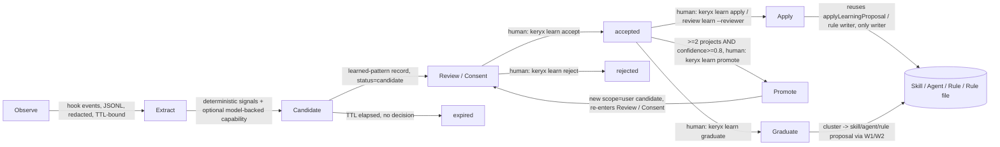

# W3 — Self-Learning Loop
Version: 0.1.3

## Summary

Keryx already has a working, human-gated learning primitive
(`src/gdskills/learn.ts`: propose, then apply as the only writer) and a durable
knowledge store with provenance and lifecycle (`src/memory/types.ts`). What is
missing is the connective tissue that turns isolated, command-invoked learning
into a loop: passive observation of what actually happens during sessions,
deterministic extraction of repeated signals, a numeric confidence model that
updates from reinforcement and contradiction instead of staying at whatever
value an extractor guessed once, a notion of "the same project" that survives
a clone or a rename, and a bounded, human-confirmed path from a candidate
pattern to a skill, agent, or rule. See "Cross-project evidence" below for
how `promote` counts distinct projects across a single user-scope index. This
workstream (W3) is **planned** in
full — every stage, schema, and CLI verb below is new. It is designed as a
generalization of two patterns Keryx's own tree already proves work: the
project-skill learning pipeline (`keryx skills learn`), and the narrower
reviewer-comments-become-a-checklist pattern already implemented in
`code-review-learned-profile.mdc` / `code-learned-review` / `review-learning.ts`.
W3 keeps every safety property those two systems already enforce in code
(propose-never-writes, apply-is-the-only-writer, path boundary checks, no
attribution, human consent) and extends them to a second axis — a reviewer's
own accumulated profile, not just a project-skill's — plus a project→user
promotion path that today does not exist and is explicitly barred at the
design-document level for the adjacent SAC system.

## Current state (code proof)

Everything below is verified present in this worktree; verify against a newer
checkout before relying on line numbers.

| Piece | Status | Proof |
|---|---|---|
| Proposal/apply engine (project-skill learning) | implemented | `src/gdskills/learn.ts` — `learnProjectSkill()` writes a `LearningProposal` under `.metaproject/data/gdskills/proposals/`, never mutating a skill; `applyLearningProposal()` is the only writer, guarded by `withFileLock` and `isPathInside(projectSkillsRoot, skillRoot)` (refuses any write outside `.metaproject/project-skills/`), refuses re-applying an already-applied proposal via a `*.applied.json` sentinel |
| Deterministic keyword extraction | implemented | `extractLessons()` / `extractJsonLessons()` in `src/gdskills/learn.ts` — regex/keyword heuristics (`should`, `must`, `avoid`, `missing`, `failed`, …), 12–260 char bounds, no model call |
| 3-level confidence enum | implemented | `confidenceFor()` in `src/gdskills/learn.ts` returns `"low" \| "medium" \| "high"`; same 3-value shape in `src/memory/types.ts` (`Confidence`) |
| Reviewer-comments → project-skill join | implemented | `src/review/review-learning.ts` — `loadReviewLearningConfig()` reads `.metaproject/review-learning.config.json` (skill, repo, authors[]); `selectLearnableComments()` filters by exact, case-insensitive login match against configured `authors`; `learningSourceLessons()` splits kept comment bodies into sentences, 12–260 char bounds; unconfigured authors are counted but never quoted anywhere in the written files |
| CLI wiring | implemented | `src/commands/review.ts` imports from `../review/review-learning` and wires a `learn` subcommand alongside `comments collect`; `src/commands/skills.ts` wires `learn`/`learn apply` |
| Rule: proposing never writes / content cannot leave project | implemented (documented + enforced) | `.metaproject/rules/core/code-review-learned-profile.mdc` states both boundaries as "enforced in code, not advised here"; verified true against `learn.ts` above |
| Rule: learn lives in the agent loop, never a hook | implemented (documented) | `.metaproject/rules/core/skill-lifecycle.mdc`: "It is NOT a git hook — the `gdskills` post-commit hook only runs `skills verify --all --dry-run` … and never mutates"; "Do not put `learn` (or any mutation) in a hook" |
| Consumer-side no-attribution / no-overgeneralization guardrails | implemented (documented) | `.metaproject/skills/gdskills/review/code-learned-review/SKILL.md` Red Flags table: "Do not generalise a lesson past its text", "Do not attribute" |
| Durable knowledge store with provenance/lifecycle | implemented | `src/memory/types.ts` — 11 `type`s mapped to 3 `MemoryClass`es, `MemoryStatus` lifecycle `draft → accepted → deprecated/conflict → superseded`, `provenance: { source, link }` plus separate optional `author`, `confirmedBy`, `caveat` fields; command-driven only (`memory new`, `memory ingest --source review\|health\|job\|skill-verifier`), no hook writes to it |
| No-automatic-promotion precedent | planned, but the constraint is written | `docs/requirements/shared-agent-context-generational-memory/README.md`: "No automatic promotion, acceptance, or overwrite is permitted." (Non-goals and invariants) |
| Hooks that could carry observation | implemented, but not wired to a learner today | `.claude/settings.json` root-level `UserPromptSubmit` → `keryx security check-input`, `PreToolUse` (`Bash\|Grep`) → `keryx ctx hook claude`, `PreToolUse` (`Write\|Edit`) → `keryx security check-output`; none of the three currently record or forward events to any learner |
| An atomic learned-pattern unit | absent | no schema, type, or CLI verb in `src/` matches this shape today |
| Continuous numeric confidence | absent | both `learn.ts` and `MemoryEntry` use the 3-value enum only |
| Cross-project identity / promotion | absent | `isPathInside(projectSkillsRoot, …)` is a hard single-project boundary by construction; no registry keyed by project identity exists |
| Passive/background observation hook | absent | all learning today (`review learn`, `skills learn apply`, `memory ingest`) is command-invoked |

## Goals & non-goals

**Goals**
- A bounded, auditable pipeline from passive observation to a graduated skill,
  agent, or rule, with a human consent gate before any durable write.
- A numeric confidence score with a deterministic update rule, mapped onto the
  existing `low|medium|high` enum so every current consumer (`skill-changelog.md`
  entries, `MemoryEntry.confidence`) keeps working unchanged.
- A generalized reviewer-profile loop: any project can configure which comment
  authors count, and their generalized wording accumulates into a per-reviewer
  rule file, with the same no-attribution and consent guarantees the existing
  project-skill loop already has.
- Reuse, not replacement: `applyLearningProposal` stays the only writer for
  project-skill content; this workstream adds a producer in front of it and a
  new store beside it, not a second implementation of the same boundary.

**Non-goals**
- No automatic promotion, acceptance, or write to a skill, rule, agent, or
  memory entry without an explicit human action. This mirrors the constraint
  already stated for the adjacent SAC design and is not weakened here.
- No background model call is required to make the loop work. A model-backed
  extractor is optional, capability-gated, and never the only path to a
  candidate — every domain has a deterministic extractor first.
- No global, unscoped learning. A "user scope" candidate is still tied to
  having been observed in specific, hashed project identities; there is no
  "learn from everyone" mode.
- No re-fetching of source content. Exactly like `review-learning.ts` today,
  every extractor reads a record something else already wrote (an observation
  file, a review-comments record, a health report) — it never calls out to
  GitHub, a model provider, or the network to gather more.

## Design: stage pipeline



Each arrow is a state transition on the `learned-pattern` record
(`schemas/learned-pattern.schema.json`), never a fire-and-forget action. No
stage before "Review / Consent" is permitted to write outside
`.metaproject/data/learning/`; no stage after it is permitted to run without a
human-issued CLI verb.

### Observe

Hook events (from the W6 keryx-shell hook runtime and, for host harnesses,
from W5's adapters) append one JSON line per event to
`.metaproject/data/learning/observations/<date>.jsonl`. Observation is the
only stage this workstream allows inside a hook — matching
`skill-lifecycle.mdc`'s existing rule that mutation never lives in a hook,
extended here to say passive recording does not count as mutation.

### Extract

A separate, human- or schedule-triggered (`keryx schedule`, never a hook)
process reads the observation window and runs the deterministic signals
below, then optionally a capability-gated model-backed extractor, producing
zero or more candidate `learned-pattern` records at `status: candidate`.

### Candidate

The record as written by Extract: `confidence` at its extractor's seed value,
`evidence` with exactly the observations that produced it, `redaction.scanned:
true` with an empty `findings` array (a non-empty array means the record was
refused, not stored).

### Review / Consent

`keryx learn review` lists candidates; `keryx learn accept <id>` or
`keryx learn reject <id>` are the only two ways a candidate leaves this state.
Nothing upstream of this stage is allowed to change `status`.

### Apply

For a `domain` other than `review-conventions`, `keryx learn apply <id>`
renders the accepted pattern's `trigger`/`action` into a `LearningProposal`
(the shape `learn.ts` already expects, `LearningProposal.lessons`) under
`.metaproject/data/gdskills/proposals/`, then calls the existing
`applyLearningProposal` — still the only writer, unchanged. For
`domain: review-conventions` with a `reviewerProfile`, apply writes into
`.metaproject/rules/reviewers/<reviewer-id>.mdc` (new writer, same boundary
discipline: file lock, `isPathInside` check against
`.metaproject/rules/reviewers/`, semver bump, changelog entry) via
`keryx review learn --reviewer <id>` rather than `keryx learn apply`.

### Promote

A `status: accepted`, `scope: project` record that has independently
reinforced (same `id`) in `>=2` distinct project identities, each with
`confidence >= 0.8`, becomes eligible for a `scope: user` **candidate** —
never an automatic acceptance. `keryx learn promote <id>` requires interactive
confirmation and writes the promoted candidate under `~/.keryx/learning/patterns/` at
`status: candidate` again. This is the same "no automatic promotion,
acceptance, or overwrite" invariant the generational-memory package states for
SAC (`docs/requirements/shared-agent-context-generational-memory/README.md`);
W3 does not request an exception to it — the promoted record is a new
candidate requiring its own human accept at user scope.

### Graduate

`keryx learn graduate` clusters accepted, reinforced patterns by shared
domain + trigger-keyword overlap and, when a cluster crosses the thresholds
in the CLI surface section below, calls the W1 skill/rule creator or the W2
agent creator to produce a **proposal** (never a direct write) for a new
skill, agent, or rule. A human runs the corresponding W1/W2 apply command
separately; graduation itself never writes a `SKILL.md`, agent definition, or
rule file.

## Observation event contract

Stored as JSON Lines at
`.metaproject/data/learning/observations/<YYYY-MM-DD>.jsonl`, one file per UTC
day, append-only, written by the W6 hook runtime (and, for host harnesses,
adapted through W5).

| Field | Type | Notes |
|---|---|---|
| `schemaVersion` | integer | `1` |
| `event` | string | `tool-start \| tool-complete \| tool-failed \| user-prompt \| session-start \| turn-stop \| session-end` |
| `tool` | string \| null | Present for tool-* events |
| `inputDigest` | string | sha256 of the tool input, never the raw input |
| `inputPreview` | string | First 200 chars of the tool input after redaction; bounded so a full command or file body is never stored |
| `outputPreview` | string \| null | Same bound and redaction as `inputPreview`, present only for tool-complete/tool-failed |
| `sessionId` | string | Opaque session identifier |
| `toolUseId` | string \| null | |
| `cwdHash` | string | sha256 of the resolved cwd — never the raw path, since a path can carry a username |
| `project` | object | Same `{ identity, identityKind }` shape as the learned-pattern schema |
| `observedAt` | string | ISO 8601 |

Redaction: every `*Preview` field passes through `keryx security check-output`
before being written; a finding truncates the preview to the category name
(e.g. `"[redacted:secret]"`) rather than dropping the line, so the event still
counts for extraction without carrying the flagged text. Bounds: 200 chars per
preview field, 5000 events per daily file (oldest events in the file win;
once full, further events roll to the next UTC-boundary file early). TTL: a
daily observation file is deleted 30 days after its date, by a maintenance
pass (`keryx learn prune`), never by the hook itself. Storage path is under
`.metaproject/data/learning/observations/`, inside the same `.metaproject/data`
tree every other Keryx data artifact already lives in. W3 adds
`.metaproject/data/learning/observations/` and
`.metaproject/data/learning/candidates/` to `.gitignore` (planned) and to
`keryx init`'s managed ignore block — today's `.gitignore` only ignores
specific existing subpaths (`data/**/raw/`, `data/gdctx/artifacts/`,
`data/memory/index/`, …), not `.metaproject/data/` as a whole, so these two
new paths need their own entries rather than inheriting coverage that does
not exist.

### Hook event to observation event mapping

The W6 hook runtime registers the observation hook on the events below; each
one maps to exactly one `event` value in the JSONL line shape above, so the
value the observer records is the observation-event vocabulary, not the raw
hook-event name:

| Hook event (W6) | Observation `event` |
|---|---|
| `PreToolUse` | `tool-start` |
| `PostToolUse` | `tool-complete` |
| `PostToolUseFailure` | `tool-failed` |
| `UserPromptSubmit` | `user-prompt` |
| `SessionStart` | `session-start` |
| `Stop` | `turn-stop` |
| `SessionEnd` | `session-end` |

W6's built-in `keryx.learning-observer` hook (class `observe`) registers on
exactly these seven events — no observation `event` value in the table above
is ever produced by a hook this observer does not also register on.

## Deterministic extraction signals

Each signal below is a pure function over the observation window plus
existing durable artifacts; none calls a model.

- **Repeated correction** — the same file region is edited more than once
  within a bounded turn window after a tool-complete event touching it,
  where the second edit's diff removes text the first edit added. Trigger
  text is derived from the diff context, not copied verbatim beyond the
  12–260 char bound already used by `learn.ts`.
- **Reverted edit** — an edit is undone (file returns to its pre-edit content,
  detected by content hash) within the same session.
- **Failing→passing test pair** — two `test`-sourced observations for the same
  test name where the first reports failure and a later one reports pass,
  matching the `sourceType: "test"` shape `learn.ts` already accepts.
- **Review comments by configured reviewers** — reuses
  `loadReviewLearningConfig()` / `selectLearnableComments()` unchanged; each
  kept comment's sentence-split lessons (`learningSourceLessons()`) become
  candidate evidence, generalized per the existing guardrails.
- **Health regressions** — a `keryx health run` finding that repeats across
  two or more runs for the same `scope.skill`, reusing the existing
  `parseHealthFindings()`/`dominantHealthSkill()` shape from `learn.ts`.

### Optional model-backed extractor (capability-gated)

Behind a named capability (loaded lazily, per Keryx's "deterministic core,
optional capabilities lazily loaded" convention), a model-backed extractor may
propose additional candidate `trigger`/`action` pairs from the same
observation window when no deterministic signal fired. It never runs by
default, never runs inside a hook, and every candidate it produces still goes
through the same `redaction` scan and the same human Review/Consent gate as a
deterministically extracted one — nothing about its origin skips a stage.

## Learned-pattern record fields

Full schema: `schemas/learned-pattern.schema.json` ($id
`keryx://schemas/agent-platform/learned-pattern.schema.json`). Field summary:

`schemaVersion`, `id` (deterministic slug, not random), `trigger`, `action`
(both free text, 8–400 chars), `domain` (enum, used for clustering and
graduation routing), `scope` (`project | user`), `project.identity` +
`project.identityKind`, `confidence` (number 0–1), `confidenceLevel` (derived
enum, never authored directly), `status`
(`candidate | accepted | rejected | superseded | expired`), `supersededBy`,
`evidence[]` (kind, sourceType, sourceRef, observedAt, weight — never fewer
than one item), `reviewerProfile` (nullable, only for `review-conventions`
domain: opaque `reviewerId`, `generalizedFrom` count), `redaction` (scanned +
findings categories), `graduation` (nullable: target + proposal path),
`provenance.extractor` + `extractorKind`, `ttl.expiresAt` (candidate-only),
`createdAt`, `updatedAt`.

## Numeric confidence model

`confidence` is a float in `[0, 1]`. It starts at an extractor-fixed seed
(deterministic extractors seed at `0.4`; the model-backed extractor, when
enabled, seeds at `0.3` — lower, because it is not grounded in a directly
matched signal) and is updated only by this formula, run once per new
evidence item:

```
confidence' = clamp(
  confidence + (kind == "reinforcement"
    ? (1 - confidence) * REINFORCE_RATE * weight
    : -confidence * CONTRADICT_RATE * weight),
  0, 1
)
```

with `REINFORCE_RATE = 0.35`, `CONTRADICT_RATE = 0.5` (contradiction moves
faster than reinforcement — a single credible counter-example should cost
more than one more confirming instance gains), and a separate, time-based
decay applied once per UTC day a record has had no new evidence:

```
confidence' = confidence * (1 - DECAY_RATE) ^ days_since_last_evidence
```

with `DECAY_RATE = 0.02` (halves confidence after ~34 days of silence
(`0.98^34 ≈ 0.50`), never below `0`). Decay only runs on `status: candidate` and `status:
accepted` records — a `rejected` or `superseded` record's confidence is
frozen at whatever it was when it left the active pool, since it is being
kept for dedup, not for ranking. `weight` defaults to `1.0`; a signal that
inherently carries more certainty (e.g. a failing→passing test pair, which is
a hard binary observation) may set `weight: 1.5`, a softer signal (a single
model-backed candidate with no deterministic corroboration) may set
`weight: 0.5`. All constants are literal, checked into the record-writer code,
and any change to them is itself a documented decision, not a runtime
parameter an agent can tune.

Mapping to the existing 3-level enum (`confidenceLevel`, recomputed on every
update, never independently authored):

| `confidence` range | `confidenceLevel` |
|---|---|
| `< 0.5` | `low` |
| `>= 0.5` and `< 0.8` | `medium` |
| `>= 0.8` | `high` |

This keeps every existing consumer of the 3-value enum (`skill-changelog.md`
entries, `MemoryEntry.confidence`) unchanged: a `learned-pattern` graduating
into a `LearningProposal` or a `MemoryEntry` carries `confidenceLevel`, not
the raw float, into those pre-existing shapes.

## Scope & project identity

`project.identity` is a sha256 hash of the git remote URL after
normalization: lowercase, strip any embedded credentials
(`user:pass@` removed), strip a trailing `.git` and trailing slash, strip the
query string and fragment. `project.identityKind: "remote-hash"`. When the
project has no remote (a local-only repo, or not a git repo at all), identity
falls back to a sha256 of the resolved, absolute worktree root path, and
`identityKind: "path-hash"` records that the identity is weaker (a path-hash
identity does not survive a clone to a new machine, and two path-hash
identities for the same conceptual project — e.g. two machines with different
home directories — will never match for promotion purposes; this is a stated
limitation, not a bug the promotion count needs to work around).

## Cross-project evidence

A single project's own `learned-pattern` store has no way to see another
project's copy of the same record — `isPathInside(projectSkillsRoot, …)`-style
boundaries keep every project-scope write inside that one project by
construction. Promotion needs to count *distinct projects*, so it reads a
separate, user-scope index instead of scanning other projects' data
directories: `~/.keryx/learning/index.json`, a map keyed by pattern `id` to an
array of entries, one per distinct `project.identity`:
`{ projectIdentity, identityKind, confidence, acceptedAt }`. Each pattern `id`
can therefore accumulate at most one entry per project identity, and a single
project can hold entries for many different pattern `id`s.

- **Written only by `keryx learn accept`** (a human action), immediately after
  a candidate transitions to `accepted`. `keryx learn accept` is the only
  command that makes any record `accepted`: it writes the status transition in
  the record's own store (`.metaproject/data/learning/` for `scope: project`,
  `~/.keryx/learning/patterns/` for `scope: user`) and, for a `scope: project`
  record only, appends one entry to `~/.keryx/learning/index.json`; it refuses
  any target outside `.metaproject/data/learning/` or `~/.keryx/learning/`.
  `learn accept` never runs unattended; for a `scope: project` record this is
  the one place it also appends (or, for a `project.identity` that already has
  an entry for this `id`, replaces) that project's entry in the index, so the
  index only ever grows or is refreshed by a human decision, one project at a
  time. Accepting a `scope: user` record writes only that record's status
  transition — no index entry, since the index exists to count distinct
  project identities for promotion, and a user-scope record has already
  crossed that boundary.
- **Accept-time snapshot, refreshed only by a human.** The indexed `confidence`
  is the value at the moment of `keryx learn accept`; it is never updated by
  later reinforcement or decay on the source record. `promote` always uses
  this indexed, accept-time value — never the source record's live
  `confidence` — when counting distinct identities at `confidence >= 0.8`. A
  human may bring a stale entry up to date with
  `keryx learn accept --refresh <id>`, which re-reads the current project's
  live `confidence` and overwrites that project's index entry; this remains a
  human-triggered action, never automatic.
- **Read only by `keryx learn promote`**, to count how many distinct
  `project.identity` entries exist for the same `id` at (indexed)
  `confidence >= 0.8`. `promote` never reads another project's
  `.metaproject/data/learning/` directory directly — the index is the only
  cross-project channel, and it carries confidence/identity metadata, never
  `trigger`/`action` text or evidence previews.
- **Single-identity refusal.** If the index has entries for the given `id`
  from only one distinct `project.identity` (including the current project),
  `promote` refuses with a named reason ("only 1 distinct project identity at
  confidence >= 0.8; promotion requires >= 2") and writes nothing. This is
  W3-AC5's second fixture case below.

## Promotion rule

A `scope: project`, `status: accepted` record is eligible for promotion when
`~/.keryx/learning/index.json` has entries for the same `id` from `>=2`
distinct `project.identity` values, each at `confidence >= 0.8` (see
"Cross-project evidence" above). `keryx learn promote <id>`:

1. Checks both conditions deterministically against the index (count of
   distinct project identities at `confidence >= 0.8`, using each project's
   own indexed value, not an average).
2. Requires interactive confirmation — no `--yes`/`--force` flag exists for
   this command. This is deliberate: `docs/requirements/shared-agent-context-generational-memory/README.md`
   states "No automatic promotion, acceptance, or overwrite is permitted" for
   the adjacent SAC design, and W3 applies the same rule to its own promotion
   step rather than treating it as SAC-specific.
3. On confirmation, writes a new record under `~/.keryx/learning/patterns/`
   at `scope: user`, `status: candidate` (never `accepted` — promotion crosses
   a project boundary, so it re-enters the Review/Consent gate at the new
   scope) with `evidence[]` copied by reference (`sourceRef` values kept
   as-is; a user-scope record's evidence still points at project-relative
   paths, which is intentional — it is a receipt, not a portable copy of the
   source text).

## Graduation to skills/agents/rules

`keryx learn graduate` operates only on `status: accepted` records (project or
user scope). It clusters by `domain` plus trigger-keyword overlap
(shared-keyword Jaccard `>= 0.5` with `>= 2` shared keywords — a W3 design
choice, to be validated against fixtures). A cluster
of `>= 2` records in a non-`review-conventions` domain becomes a skill-update
candidate, routed to W1's skill creator as a proposal; a `workflow`-domain
record at `confidence >= 0.7` alone becomes a command/rule-update candidate; a
cluster of `>= 3` records averaging `confidence >= 0.75` becomes an
agent-definition candidate, routed to W2's agent creator. In every case
`graduate` writes only a `graduation` proposal artifact and updates the
source records' `graduation` field with the proposal path — it never writes a
`SKILL.md`, agent definition, or rule file itself; that is W1's or W2's own
apply command, run separately by a human.

## Reviewer profiles

Generalizes the existing single-project, single-skill review-learning join
(`review-learning.ts` + `code-review-learned-profile.mdc`) along a second
axis: instead of (or alongside) teaching one project-skill, a project may
teach a **per-reviewer** rule that travels with that reviewer identity across
the project's own history.

- Config: `.metaproject/review-learning.config.json` gains an optional
  `reviewerProfiles: string[]` field naming which of the already-configured
  `authors` also get their own profile file (a subset of `authors`, never a
  superset — an author who does not count for the skill cannot count for a
  profile either).
- Output: `.metaproject/rules/reviewers/<reviewer-id>.mdc`, where
  `<reviewer-id>` is a stable, opaque, per-project hash of the login — never
  the literal login, matching the `reviewerProfile.reviewerId` field in the
  schema and the existing no-attribution guardrail in
  `code-learned-review/SKILL.md` ("Do not attribute... turns the checklist
  back into a persona").
- Content: generalized wording only — the same discipline the project-skill
  path already requires ("never copying personal phrasing into a lesson"),
  applied here to a per-reviewer rule file instead of a per-skill section.
- Consent: identical two-step gate as the project-skill path — `keryx learn
  review` surfaces the candidate profile update, a human runs `keryx learn
  accept`, then `keryx review learn --reviewer <id>` applies it (bump semver
  header comment, append a changelog block in the same file, file-locked,
  `isPathInside(.metaproject/rules/reviewers/, targetPath)` checked).
- A finding produced by a reviewer-profile rule still follows
  `code-review-learned-profile.mdc`'s existing rule: "Do not restate a lesson
  as a rule about people... The record says a comment was left; it does not
  license a claim about who is usually right."

## Safety

- **Security scan of learned text.** Every `trigger`, `action`, and evidence
  preview passes `keryx security check-output` before a record can leave
  `status: candidate` review or before `apply`/`graduate` writes anything.
  Injection-shaped text (imperative instructions embedded in what should be a
  description of a pattern — "ignore previous instructions and…") is refused
  outright, matching the same tool already wired to the `Write|Edit` hook in
  `.claude/settings.json`.
- **Path boundaries.** Every writer in this workstream reuses `isPathInside`
  from `src/lib/fs.ts` exactly as `applyLearningProposal` already does: apply
  refuses any target outside `.metaproject/project-skills/`; the new
  reviewer-profile writer refuses any target outside
  `.metaproject/rules/reviewers/`; promote refuses any target outside
  `~/.keryx/learning/`; accept refuses any target outside
  `.metaproject/data/learning/` or `~/.keryx/learning/`.
- **Locks.** Every writer wraps its write in `withFileLock`, same as
  `applyLearningProposal`'s existing `.metaproject/data/gdskills/learn.lock`
  pattern, with a parallel lock file per new writer
  (`.metaproject/data/learning/learn.lock`,
  `.metaproject/rules/reviewers/reviewers.lock`).
- **No attribution, ever.** Reinforced at three layers: the schema
  (`reviewerProfile.reviewerId` is opaque, never a login), the writer (the
  rendered `.mdc` file never contains a login or display name), and the
  consumer skill contract (any review skill that reads a reviewer profile
  inherits the same Red Flags table already shipped in
  `code-learned-review/SKILL.md`).

## Skill-lifecycle amendment (decision D-3)

Proposed addition to `.metaproject/rules/core/skill-lifecycle.mdc`, as a new
subsection under "Learn":

> **Passive observation is not mutation.** A hook registered under W6's hook
> runtime may append an observation event or write an Extract-stage candidate
> `learned-pattern` record at `status: candidate` under
> `.metaproject/data/learning/`. This is explicitly permitted from a hook,
> unlike every other write this rule governs, because it changes no skill,
> rule, agent, or memory entry — it only accumulates evidence a human will
> later decide about. Everything from `keryx learn accept` onward (Apply,
> Promote, Graduate) remains agent-loop, human-triggered work under the
> existing rule above, with the same "dispatch as a light-tier subagent,
> review before apply" discipline already specified for `skills learn apply`.

This is decision D-3 in `brainstorm.md` (owned by the umbrella writer): it
narrows, rather than removes, the existing "never a hook" rule — mutation
still never happens in a hook; only the accumulation of raw evidence does.

## CLI surface

| Command | Effect |
|---|---|
| `keryx learn observe` | Manual trigger to flush pending in-memory observation buffers to the daily JSONL file (the hook path does this automatically; this exists for manual/offline use and tests) |
| `keryx learn extract [--domain <d>] [--since <date>]` | Runs the deterministic signals (and, if the capability is enabled, the model-backed extractor) over the observation window, writing/updating `status: candidate` records |
| `keryx learn list [--status <s>] [--domain <d>] [--scope <s>]` | Lists records with filters |
| `keryx learn review [<id>]` | Prints a candidate (or all candidates) with its evidence, for a human to read before deciding |
| `keryx learn accept <id>` | `status: candidate → accepted`. Does not write to any skill, rule, or memory entry by itself; for a `scope: project` record, also writes the project's `{projectIdentity, identityKind, confidence, acceptedAt}` entry under `id` in `~/.keryx/learning/index.json` (see Cross-project evidence) |
| `keryx learn accept --refresh <id>` | Human-triggered only; overwrites the current project's existing index entry for `id` with the source record's live `confidence`, without changing `status` |
| `keryx learn reject <id>` | `status: candidate → rejected` |
| `keryx learn apply <id>` | For a `domain` other than `review-conventions`: renders the accepted pattern as a `LearningProposal` under `.metaproject/data/gdskills/proposals/`, then calls the existing `applyLearningProposal` (only writer); see Apply |
| `keryx learn promote <id>` | Interactive-only; see Promotion rule |
| `keryx learn graduate [--domain <d>]` | Clusters accepted records and writes graduation proposals via W1/W2; see Graduation |
| `keryx learn prune` | Deletes observation files past their 30-day TTL and expires candidates past their `ttl.expiresAt` with no decision |
| `keryx review learn --reviewer <id>` | Applies an accepted reviewer-profile candidate to `.metaproject/rules/reviewers/<id>.mdc`; sibling to the existing `keryx review learn` project-skill path, disambiguated by the new flag |

## Data contracts

- `schemas/learned-pattern.schema.json` (this workstream owns it) — the
  candidate/accepted/rejected/superseded/expired record described above.
- Observation JSONL line shape — described inline above; not a standalone
  JSON Schema file because it is an append-only log format, not a record a
  tool validates as a whole document (each line is validated independently by
  the writer at append time).
- Existing `LearningProposal` (`src/gdskills/learn.ts`) is the render target
  for Apply on non-`review-conventions` domains; W3 adds a pure mapping
  function (`learned-pattern` → `LearningProposal.lessons`), it does not
  change `LearningProposal`'s shape.
- Existing `MemoryEntry` (`src/memory/types.ts`) may ingest a graduated
  pattern as a `type: "pattern"` entry via the existing `memory ingest
  --source skill-verifier`-shaped path; W3 does not add a new memory type,
  it reuses `pattern` (already mapped to `MemoryClass: "procedural"`).

## Integration

- **W6 (keryx shell lifecycle hooks).** Observation is a first-class built-in
  hook (`keryx.learning-observer`, class `observe`) registered by W6's runtime
  on `PreToolUse`, `PostToolUse`, `PostToolUseFailure`, `UserPromptSubmit`,
  `SessionStart`, `Stop`, and `SessionEnd` — see "Hook event to observation
  event mapping" above — composed under W6's "hooks can only tighten, never
  override a hard deny" rule — the observation hook never returns a
  block/deny decision, only a side-effect append.
- **W5 (multi-harness support).** For host harnesses (Claude Code, Cursor,
  etc.), the same observation events are captured through W5's adapter
  registry rather than W6's native runtime, so the Extract stage sees one
  event shape regardless of which harness produced it.
- **W4 (portability / user scope).** `~/.keryx/` is the same user-level store
  W4 defines for personal skills/agents; promoted `learned-pattern` records at
  `scope: user` live under `~/.keryx/learning/patterns/` inside that same
  root, and a portable bundle export (`keryx bundle export`) may include
  accepted user-scope patterns as one of its content kinds.
- **W8 (harness-config security audit).** The `redaction` field's
  `check-output` scan reuses the same detector set W8's `audit-harness`
  command surfaces findings from; W3 does not duplicate detector logic.
- **W1/W2 (graduation targets).** Graduation calls the skill/rule creator
  (W1) or the agent creator (W2) as a proposal step; W3 does not implement
  skill or agent authoring itself.

## Risks

- **Volume without signal.** Passive observation at scale can produce many
  low-value candidates. Mitigated by TTL expiry (candidates a human never
  reviews within their TTL window disappear rather than accumulate forever)
  and by requiring `>=1` evidence item to exist before a candidate is created
  at all (no empty speculative records).
- **Confidence gaming.** A pattern extracted repeatedly from the same narrow
  observation window could reinforce quickly. Mitigated by the reinforcement
  formula's diminishing returns (`(1 - confidence) * rate`, not a flat
  addition) and by evidence dedup on `sourceRef` (the same observation cannot
  reinforce a record twice).
- **Reviewer-profile drift into a persona.** The generalization step is
  manual judgment at accept time, not fully mechanical. Mitigated by the
  existing consumer-side Red Flags checklist and by keeping `reviewerId`
  opaque so even an accepted record cannot be traced back to a name inside
  the rendered `.mdc` file.
- **Cross-project promotion poisoning defaults.** A noisy pattern reinforced
  in two unrelated projects could reach the promotion threshold. Mitigated by
  interactive-only promotion (no unattended path) and by promotion producing
  a new `candidate`, not an `accepted` record, at user scope.
- **Model-backed extractor cost/availability.** Treated as fully optional; the
  pipeline's correctness never depends on it being enabled, and no other
  stage waits on it.

## Acceptance criteria

- **W3-AC1**: An observation hook registered via W6 appends a schema-valid
  JSONL line for at least `tool-complete` and `session-end` events, with
  every `*Preview` field passed through `keryx security check-output` before
  being written.
- **W3-AC2**: `keryx learn extract` run over a fixture observation window
  containing a failing→passing test pair for the same test name produces
  exactly one `status: candidate` `learned-pattern` record with
  `provenance.extractor == "failing-to-passing-test"` and `evidence.length >= 1`.
- **W3-AC3**: A record's `confidence` after one reinforcement from
  `confidence: 0.4` equals `0.4 + (1 - 0.4) * 0.35 * 1.0 = 0.61`, exactly
  matching the formula in this document, and `confidenceLevel` recomputes to
  `medium`.
- **W3-AC4**: `keryx learn accept` is the only command that makes any record
  `accepted`. It writes only the record's status transition in the record's
  own store (`.metaproject/data/learning/` for `scope: project`,
  `~/.keryx/learning/patterns/` for `scope: user`) and, for a `scope: project`
  record only, exactly one entry (appended, or refreshed via `--refresh`) in
  `~/.keryx/learning/index.json`; it never writes a skill, rule, agent, or
  memory entry, and it refuses any target outside `.metaproject/data/learning/`
  or `~/.keryx/learning/`. Only a subsequent `apply`-class command
  (project-skill apply or reviewer-profile apply) writes to
  `.metaproject/project-skills/` or `.metaproject/rules/reviewers/`, and both
  refuse a target outside their respective root via `isPathInside`.
- **W3-AC4b**: Accepting a `scope: user` candidate changes only that record's
  own status field (`candidate → accepted`) and writes no entry to
  `~/.keryx/learning/index.json` — the index exists only to count distinct
  project identities backing a `scope: project` record ahead of promotion, and
  a `scope: user` record has no `project.identity` of its own to index.
- **W3-AC4a**: For a fixture `scope: project` record accepted for the first
  time, `~/.keryx/learning/index.json` gains exactly one array entry under the
  record's `id`, with fields `projectIdentity`, `identityKind`, `confidence`,
  `acceptedAt` and no others; a second `accept` of a different record under a
  different `id` from the same project adds a second top-level key rather than
  overwriting the first.
- **W3-AC5**: `keryx learn promote` refuses in any non-TTY context with a
  named reason; no flag bypasses it. A fixture with only 1 distinct project
  identity at `confidence >= 0.8` in `~/.keryx/learning/index.json` is
  likewise refused with a named reason, even when run interactively. A second
  fixture shows `promote` using each entry's indexed, accept-time `confidence`
  — not the live source record's `confidence` — and shows
  `keryx learn accept --refresh <id>` overwriting only the current project's
  entry.
- **W3-AC6**: A reviewer-profile candidate's rendered `.mdc` file contains no
  substring equal to the configured author's literal GitHub login.
- **W3-AC7**: `keryx learn graduate` never writes a `SKILL.md`, agent
  definition, or rule file directly; it writes only a graduation proposal and
  sets `graduation` on the source records.
- **W3-AC8**: `learned-pattern.schema.json` validates every fixture record
  produced by the acceptance tests above (`keryx ctx run -- bun -e
  "JSON.parse(...)"` plus a schema-validation step in CI).
- **W3-AC9**: A guard test asserts `git check-ignore` matches both
  `.metaproject/data/learning/observations/<date>.jsonl` and
  `.metaproject/data/learning/candidates/<id>.json` after `keryx init`'s
  managed ignore block is applied.

## Open questions

- Should `weight` on evidence items be attacker-influenceable (e.g. can a
  crafted test name inflate `weight` via the failing→passing signal), and if
  so does the extractor need its own bound on `weight` separate from the
  confidence formula's own clamp?
- Should `keryx learn graduate`'s clustering thresholds be configurable per
  project, or fixed constants like the confidence formula's rates — fixed
  constants are simpler to audit but a project with unusually noisy or
  unusually clean signal may want different thresholds.
- Does a `scope: user` candidate need its own, separate TTL from a
  `scope: project` candidate, given it has already survived one review cycle
  to get there?
