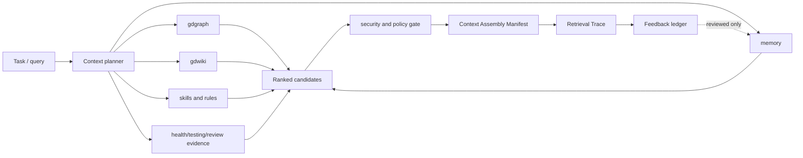

# Keryx Context Operations — Specification
Version: 1.1.0

## Identity and status

`context-operations` — a future cross-cutting Keryx capability. Status:
`future`. The existing modules remain the sources of domain logic; this new
layer only plans, assembles, explains and evaluates context.

## Architecture



## Storage structure

```text
.metaproject/
  context.config.json                         # source config, seed-once
  data/context/
    assemblies/<assembly-id>.json             # generated, disposable receipt
    traces/<assembly-id>.json                 # generated, redacted trace
    feedback/<assembly-id>.jsonl              # append-only, policy guarded
    eval/<run-id>/{report.md,report.json}     # generated validation evidence
  memory/                                     # existing Markdown source of truth
  wiki/                                       # existing Markdown source of truth
```

`data/context/` is **not** a source of decisions. It can be deleted and rebuilt
from the commit, the query, the config and the source artifacts. Writes to
`memory/`, `wiki/` and `project-skills/` stay behind their own guards.

## Configuration

```json
{
  "schemaVersion": "1.0",
  "enabled": false,
  "budget": { "maxBytes": 262144, "maxEstimatedTokens": 48000, "maxItems": 40 },
  "sources": { "graph": true, "wiki": true, "memory": true, "skills": true, "quality": true },
  "ranking": { "lexical": 0.35, "scope": 0.2, "freshness": 0.15, "trust": 0.2, "graph": 0.1 },
  "semantic": { "enabled": false, "provider": null },
  "externalAdapters": [],
  "feedback": { "requireReviewForPromotion": true }
}
```

The capability is **off by default**. With `enabled=false` it imports no optional
packages, opens no network connection, and changes the behaviour of no existing
command.

## CLI and MCP surface

| Surface | Contract | Status |
|---|---|---|
| `keryx context assemble <query>` | Creates a manifest and trace; returns bounded context with citations, or a typed `context_overflow` | future |
| `keryx context explain <assembly-id>` | Shows selected and dropped candidates with their scores | future |
| `keryx context feedback <assembly-id>` | Appends a guarded feedback record | future |
| `keryx context eval --corpus <path>` | Runs a fixture corpus and publishes a report | future |
| MCP `context_assemble`, `context_explain` | Read-only semantic parity with the CLI | future |

`context feedback` never creates accepted memory on its own. Promotion happens
through the existing memory lifecycle and an explicit approval.

### Typed failure contract

If the required items do not fit within at least one budget, `assemble` does not
produce a partial successful manifest. It returns a schema-valid
[ContextError](schemas/context-error.schema.json) with `code:
"context_overflow"`, the dimension that was breached (`bytes`,
`estimated_tokens` or `items`), the requested budget, and the list of required
source IDs. The CLI and MCP must normalize to the same error object; raw or
redacted content is never included in the error.

## Planner algorithm

1. Validate the query or work item and the requested budget.
2. Extract mandatory items: the active security policy, applicable procedural
   rules, and frozen flow acceptance criteria.
3. Collect source candidates from the existing services that are available. A
   source that is unavailable, stale or invalid is **recorded in the trace, not
   masked**.
4. Filter by scope, status, temporal validity, trust and policy.
5. Compute an explainable deterministic score. Optional semantic and graph
   adapters may only rerank the candidate pool that has already been formed.
6. Assemble the bounded manifest. Mandatory policy items are never evicted by
   score. A successful manifest records `projectRevision`, `configHash`,
   used-item accounting and `budgetStatus: "within-limits"`; the service
   separately verifies that the used values do not exceed the maxima.
7. Run the redaction/security gate, then persist the redacted receipt and trace.

## Data contracts

The schemas are part of the contract and must validate against Draft 2020-12:

- [ContextAssemblyManifest](schemas/context-assembly-manifest.schema.json)
- [ContextCandidate](schemas/context-candidate.schema.json)
- [RetrievalTrace](schemas/retrieval-trace.schema.json)
- [ContextError](schemas/context-error.schema.json)
- [ExternalAdapter](schemas/external-adapter.schema.json)

### Integration contract

- `gdgraph`: accepts stored graph artifacts only. Graph distance is a score
  component, not evidence that a fact is current.
- `gdwiki`: accepted pages, and validated drafts only when explicitly labelled.
- `memory`: accepted/current entries by default; drafts and conflicts are visible
  only on an explicit diagnostics request.
- `gdskills`: procedural instructions enter the manifest carrying their version
  and verification status.
- `security`: a single choke point redacts tool output and blocks forbidden write
  intents in enforced and CI modes.
- `flow`: mandatory constraints and acceptance criteria are added before ranking.
- external adapter: the descriptor must carry an immutable `id`, `mode`,
  namespace, retention, provenance strategy and enabled flag. In R0/R1 an adapter
  has no write authority; a network adapter is off by default and passes a
  separate capability/policy gate.

## Acceptance criteria

- **AC-1 / CO-1–4:** the assembler produces a schema-valid manifest in which
  every selected item has a source reference, a hash, and a reason for selection.
- **AC-2 / CO-5–6:** the disabled floor is byte-identical; an optional provider is
  not called while the capability is off or its assets are unverified.
- **AC-3 / CO-7–9:** feedback and untrusted text cannot directly promote
  knowledge to accepted, procedural or skill status.
- **AC-4 / CO-10:** CLI/MCP parity fixtures yield an identical normalized manifest
  and trace, transport metadata aside.
- **AC-5 / CO-11:** every adapter has an explicit config, source namespace,
  retention and provenance; network adapters are off by default.
- **AC-6 / CO-12–13:** the documented checkout invocation works; the corpus suite,
  the schemas and the reports all pass in CI.
- **AC-7 / CO-3:** byte, token and item budget overflows return a typed
  `context_overflow`, preserve the required source IDs, and never emit a
  partial-success manifest.
